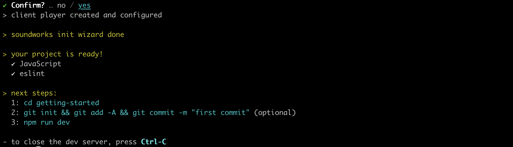

# Getting Started

In this guide, you will learn how to setup a simple `soundworks` application where any connected user will be able to trigger a flash on the screen of all connected clients.

The tutorial requires basic knowledge of _JavaScript_, _Node.js_ and of the command-line. If you are just starting with _JavaScript_ development, please first set up a working environment following the instructions [here](/misc/setting-up-environment.html) and come back when done.

### Prerequisites

- [Node.js 16+](https://nodejs.org/en/)
- A modern browser (e.g. Chrome, Firefox)

<!-- [[toc]] -->

## Step 1 - Setting things up

The best and most simple way to create a new `soundworks` application is to use the dedicated command line tools: 


So first thing first, open a Terminal, go to some directory and execute the following command:

```sh
cd path/to/working/dir
npx @soundworks/create@latest
```

:::tip
If you run the command for the first time (which is quite likely), the `npx` command will tell you that it needs to install the `@soundworks/create` package, just press `Enter` to accept and continue.
:::

The wizard will startup and ask you for the name of the directory in which you want create the application: just write `getting-started` and press `Enter`. The wizard will automatically create the directory, copy some files and install the required dependencies as illustrated in the screenshot below.

:::info
Note that the screenshots in this guide may differ slightly from what you actually see in your console, as the CLI tool might have evolved a bit since the screenshots have been made.
:::


Once the installation is done, the `@soundworks/create` wizard will propose you to install some `soundworks` plugins and some curated libraries. For now, just press `Enter` to skip this steps, we will go back there to install a libraries later.


After that step, the wizard will propose you to create a client of your application. Let's call it `player` and press `Enter` as show below.


The wizard will then ask a few questions to configure your client, again just press `Enter` to select the default values (i.e. type: `browser` and template: `default`):


Finally, the wizard will ask you to confirm your choices, press `Enter`.


The wizard will copy some files and configure the application for you. Your application is ready to be launched.

To make sure the application is correctly set up and installed, just follow the steps 1 and 3 proposed as next steps by the wizard.



After a few seconds, your server should be running:


Open you favorite browser (which shall probably not be Safari), go to [http://127.0.0.1:8000](http://127.0.0.1:8000), and tada! You should see a rather pretty black screen!

Congrats! You just configured and ran your first soundworks application. Now, let's have a closer look to the codebase.

## Step 2 - Exploring the file structure of the application

Press `Ctrl + C` to stop the server and open the `getting-started` directory in your favorite text editor. You should see the following file structure:

```sh
getting-started
├── .build              # The directory where your application is built
├── config              # Configuration files
│   ├── env
│   └── application.json  
├── node_modules        # Directory where all dependencies are installed
├── public              # Directory that is exposed by the server
├── src
│   ├── clients         # The directory where all clients are declared
│   │   ├── components  
│   │   ├── player      # Source code of the `player` client you just created
│   ├── server          # Source code of the server
│   └── utils   
├── package.json        # This file contains the declaration of your dependencies
└── README              # General infos about your application
```

- The `node_modules` and `.build` directories should **_never_** be edited manually.
They are used by the Node Package Manager (i.e. `npm`) and the  `soundworks` build tools to install dependencies and bundle your application.
- The `src` directory at contrary contains all the source files of your application, this is where you will work most of the time.
- The `public` directory is the directory that is exposed to the network by the server. This is the place where you should put your static assets such as images or soundfiles that the clients of your application will download and use. It is important to keep in mind that exposing a directory to the network means that all files located in this directory will be accessible by any computer connected to the same network, so please be careful to not expose sensitive or private informations here (this is true whenever you deal with servers and networks, this is not specific to `soundworks` applications).

Now that we have an overview of the file structure of a `soundworks` application, let's write some code!

## Step 3 - Create a global shared state

First, go back to the Terminal and restart the server:

```sh
npm run dev
```

:::tip
The `dev` command (quite wisely) starts the server in development mode. This means the application will be bundled and the server restarted each time a source file is saved (which is expected to be confortable and time saving when developping an application).
:::

Open the `src/server/index.js` file and add the following lines at the end of the file:

```js{5-7}
// src/server/index.js
await server.start();

// and do your own stuff!
const globalSchema = {
  trigger: { type: 'boolean', event: true },
};
```

Here, we just create a plain old JavaScript object that follows the `soundworks` schema definition (if you are familiar with databases, you can think of it as the schema of a table). The full API documentation for a schema is accessible [here](https://soundworks.dev/soundworks/server.StateManager#~schema) but for now, it's ok to just understand that we declared some data structure a parameter named `trigger` that is configured to be a `boolean` event.

Then we will need to register this schema into the `soundworks`' state manager:

```js{5}
const globalsSchema = {
  trigger: { type: 'boolean', event: true },
};

server.stateManager.registerSchema('globals', globalsSchema);
```

Finally, we will create an global shared state instance from this schema definition:

```js{7}
const globalsSchema = {
  trigger: { type: 'boolean', event: true },
};

server.stateManager.registerSchema('globals', globalsSchema);

const globals = await server.stateManager.create('globals');
```

And that's it for the server-side logic! If everything went well, you should see no error in the Terminal, and launching a [client](http://120.0.0.1:8000) should still show you the same fancy black page.

## Step 4 - Make clients interactive

Now that the server-side logic is ready, let's implement the client-side of our simple application.

Open a browser and go to [http://127.0.0.1:8000](http://127.0.0.1:8000), then go back to your text editor and open the `src/clients/player/index.js` file.

Let's first add a line of code to display some text on the page to make sure we can act on this fancy black screen:

```js{3}
// src/clients/player/index.js
const $layout = createLayout(client, $container);
$layout.addComponent(`click here`);
```

:::tip
The `$layout` is just a convenience object proposed by the template as a starting point for building interfaces. It is based on the [lit](https://lit.dev/) library proposed by Google and its source code is located in `src/clients/player/views/layout.js`. `soundworks` does not require usage of this abstraction not of the lit library, they can both perfectly be replaced with other GUI frameworks.
:::

If you reload the page (`Cmd + Shift + R`), you should see the text "click here" displayed of the top left of your screen. Ok we are ensured, we got some control over this Web page.

Now, let's go back to our client-side logic and add the following code in the same `src/clients/player/index.js` file:

```js{4-5}
// src/clients/player/index.js
await client.start();

const globals = await client.stateManager.attach('globals');
console.log('globals shared state', globals.getValues());

const $layout = createLayout(client, $container);
```

Here, we simply attach our client to the `globals` state created by the server. This means that our client will be able to make some update to the shared state, as well as being notified when a change is made to the state state.

The second line will just log the current state of the `globals` shared state into the browser's console, so that we can check that the shared state has been successfully attached.


:::tip
To open the JavaScript console in your browser, you can press `Cmd + Alt + J` in Chrome or alternatively `Cmd + Alt + I` in Firefox, then select the `Console` tab.
::: 

Then, let's write the code that allows us to react to any change made on the shared state

```js{5-7}
await client.start();

const globals = await client.stateManager.attach('globals');

globals.onUpdate(updates => {
  console.log(updates);
});

const $layout = createLayout(client, $container);
````

In this snippet, we use the `onUpdate` method of the `globals` shared state that allows us to trigger a function (to just log the update for now, but we will come back there later).

Now, we have the logic to react to any `globals` shared state change, but nothing to trigger a change. Let's add the following code to update the value of the trigger parameter when the user click on the screen:

```js{4-6}
const $layout = createLayout(client, $container);
$layout.addComponent(`click here`);

$layout.addEventListener('click', () => {
  globals.set({ trigger: true });
});
```

Reload the page again (`Cmd + Shift + R`), and now whenever you click on the screen you should a new log in the console.


Finally, we just need to review the code inside the `onUpdate` callback to make the screen blink instead of just logging the shared state updates into the console.

```js{6-11}
await client.start();

const globals = await client.stateManager.attach('globals');

globals.onUpdate(updates => {
  if (updates.trigger === true) {
    $layout.style.backgroundColor = 'white';
    setTimeout(() => {
      $layout.style.backgroundColor = 'black';
    }, 50);
  }
});
```

Here, whenever the `trigger` parameter of the `globals` shared state is set to `true`, we pass the background of the screen to white and put it back to black after 50ms.

To see the shared state in action (more precisely why we call it "shared"), let's emulate several clients in our browser window. To that end, open [http://127.0.0.1:8000?emulate=8](http://127.0.0.1:8000?emulate=8) (note the `?emulate=8` at the end of the URL). 


If you click on any of these 8 emulated clients all of them will blink, as they are all attached to the same `globals` shared state, and thus react in the same way to the updates of the state.

## Conclusion

Congrats, you just wrote your first `soundworks` application. Along the way you learned quite a few things: 1. How to setup a `soundworks` application using the `@soundworks/create` wizard, 2. How to use some of the tools that are at your end to simplify the development, and 3. Discovered the shared states that are one of the most versatile abstraction provided by `soundworks` to simplify development and hide some network complexity.
