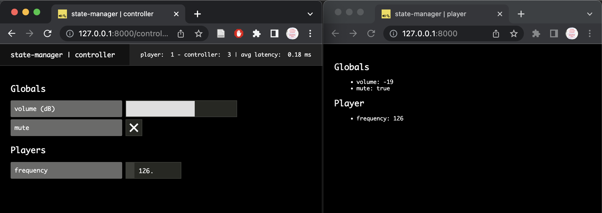

# Using the State Manager

In this tutorial, we will dig into the distributed state management system proposed by _soundworks_. After a short introduction on the concepts behind, we will see how to use shared states, and how this pattern can help you to implement remote control and monitoring in your applications. Along the way, we will see how the shared states simplify the development of distributed applications by abstracting the network communications and messages routing.

### Relevant API documentation

- [client.StateManager](https://soundworks.dev/soundworks/client.ContextManager)
- [client.SharedState](https://soundworks.dev/soundworks/client.SharedState)
- [server.StateManager](https://soundworks.dev/soundworks/server.StateManager)
- [server.SharedState](https://soundworks.dev/soundworks/server.SharedState)

## Introduction

First of all, let's start with a bit of theory to understand the concepts and general logic behind the _soundworks_' shared states. 

### The "Why"

Most of the time, we think of an application as "something" that runs on a computer with which a user can interact in some way. The idea of _distributed application_ extends this to applications that run on several computers and where several users can interact at the same time. Or to say it in a more formal way:

> _« A distributed system is a collection of autonomous computing elements that appears to its users as a single coherent system. »_ Maarten van Steen, and Andrew S. Tanenbaum. “A Brief Introduction to Distributed Systems.” Computing 98, no. 10, October 2016.


Additionally, in creative contexts, it's important to have very simple ways to monitor and/or control the state of distant clients. This is true both during the development of the artwork / application, e.g. to tweak some synthesizer on distant machines from a central point (even in the studio, modifying some parameters on several machines can get cumbersome quite quickly), as well as during a performance, e.g. to control the general volume, to switch between two sections of the experience, etc.

The `SharedManager` and the `SharedState` abstractions proposed by _soundworks_ provide a simple way to define and synchronize some sets of parameters (that are of interest by multiple clients) while abstracting all the network communications involved.

### The "How"

From a more technical point of view, the distributed state management system proposed by _soundworks_ circular dataflow pattern (loosely inspired by the [_flux_](https://facebook.github.io/flux/docs/in-depth-overview) pattern proposed by _Facebook_) adapted to the particular needs of real-time distributed applications. 

To this end the dataflow follows a circular path that is always synchronized with the server. For illustrate the, we can see in the graph below that when an input (e.g. some user gesture) triggers a change in the state of a client (arrow 1, red), the data is automatically synchronized with a server-side representation of the state through WebSockets (arrow 2), which when done triggers the change in the rendering (be it audio or visual). 

This simple pattern enables an important feature: any other node can make a change on the same server-side representation of the state (arrow 1', blue), while triggering 2 and 3 in a completely transparent way.

:::tip
In this tutorial, when we speak of a _node_ of the network, we consider both the clients and the server. 

Form the point of view of the distributed state management system, the server is indeed a _node_ just as any client. However, its central role gives it particular abilities and features.
:::


## Declaring schemas

The `StateManager` component uses "_schemas_" that declare a set of attributes and their properties (you can think of it has the schema of a database table). A _schema_ is a kind of blueprint for a shared state, as such, any number of `SharedState` instances can be created from the same schema. 

:::tip
The schema syntax follows the format described [here](https://soundworks.dev/soundworks/server.StateManager#~schema).
:::

First thing first, let's generate a new empty application with the `@soundworks/create` wizard (when the wizard will ask you for the name of the default client, just call it `player` (with the `browser` target and the `default` template) so that the rest of the tutorial will be more simple to follow):

:::info
If needed, refer to the [getting-started](/guide/getting-started) page to learn more on how to run the wizard
:::

```sh
cd /path/to/working/directory
npx @soundworks/create@latest state-manager
```

In this application we will declare two different schemas:

- A schema we will call `globals`, meant to create a shared state that will be unique across the whole application. This shared state will be created by the server and every clients of the application will attach to it.
- A schema we will call `player`, meant to describe the state of a single client of the application. All clients with the role `player` will create their own `SharedState` instance from this scheme.

So first, let's create the file `src/server/schemas/globals.js` containing the following code:

:::info
Note that the `src/server/schemas` directory included in the application template is empty and not mandatory (i.e. schema declarations could potentially live anywhere in your code). It is just proposed as a way to keep things organized.
:::

```js
// src/server/schemas/globals.js
export default {
  // volume volume in dB [-60, 6]
  volume: {
    type: 'float',
    min: -60,
    max: 6,
    default: 0,
  },
  // mute [true, false]
  mute: {
    type: 'boolean',
    default: false,
  },
};
```

While the code is quite self-explanatory, we can see that this schema will allow us to control the _volume_ of all clients as well as to _mute/unmute_ them.

Second, let's create the file `src/server/schemas/players.js` containing the following code:

```js
// src/server/schemas/player.js
export default {
  frequency: {
    type: 'float',
    min: 50,
    max: 1000,
    default: 440,
  },
};
```

This schema will allow us to control the _frequency_ of an oscillator on each client.

From these two definitions, we can already foresee the structure of the audio graph that could be created by each client:

> `[OscillatorNode] -> [GainNode (mute)] -> [GainNode (volume)] -> [destination]`

- The `OscillatorNode` will be controlled by the states created from the `player` schema, each client being able to have different oscillator _frequency_ values.
- At contrary, the `GainNode`s (_mute_ and _volume_) will be controlled globally for all clients by the common state created from `globals` schema.

:::info
Note that to keep things focused on the distributed state management system, we won't actually create the audio graph in this tutorial.
:::

## Registering schemas

Let's first import the schemas declarations into the `src/server/index.js` file:

```js {5-6}
// src/server/index.js
import { loadConfig } from '../utils/load-config.js';
import '../utils/catch-unhandled-errors.js';

import globalsSchema from './schemas/globals.js';
import playerSchema from './schemas/player.js';
```

Once done, we can register them into the `stateManager` instance of the _soundworks_ `server`:

```js {6-8}
// src/server/index.js
const server = new Server(config);
// configure the server for usage within this application template
server.useDefaultApplicationTemplate();

// register the schemas
server.stateManager.registerSchema('globals', globalsSchema);
server.stateManager.registerSchema('player', playerSchema);
```

Note that the `stateManager.registerSchema` method takes 2 arguments:
- A _user defined_ name, here `'globals'` and `'player'`.
- A schema definition, here `globalsSchema` and `playerSchema`.

This signature allows to define simple user-friendly names for creating and attaching shared state, but also to register the same schema under different names.

Now that our schemas are registered into the `server.stateManager`, we safely can create new instances of `SharedState`s based on these schemas.

## Create and attach shared states

Let's first create our `globals` shared state based on the schema declaration we defined in `src/server/schemas/globals.js`. As explained above, we want this shared state to be unique across the entire application so that all clients share the same values. This is achieved by _creating_ the state on the server-side (i.e. the server is thus the _owner_ of the state), and by _attaching_ all clients to this state (i.e. they have full access to the shared state values but do not own it).

While this distinction between `create` and `attach` can be a bit confusing at first this will get more clear writing the code. So, add following line into the `src/server/index.js` to create the `globals` shared state:

```js {4-5}
// src/server/index.js
await server.start();

const globals = await server.stateManager.create('globals');
console.log(globals.getValues());
```

Here, we create a new `SharedState` instance from the schema we just registered with the name `'globals'`. You should also see the default values of the state displayed in you Terminal window:


Let 's now _attach_ all our `player` clients to the `globals` state created by the server.

To that end, open the file `src/clients/player/index.js` and add the following lines of code:

```js {4-5}
// src/clients/player/index.js
await client.start();

const globals = await client.stateManager.attach('globals');
console.log(globals.getValues());
```

Open the URL [http://127.0.0.0:8000](http://127.0.0.0:8000) in your browser of choice and open the JavaScript console. As for the server, you should see the current values of the state displayed in the console:


:::tip
To open the _JavaScript_ console in your browser, you can press `Cmd + Alt + J` in 
_Chrome_ or alternatively `Cmd + Alt + I` in _Firefox_, then select the `Console` tab.
::: 

While we are on the client-side `player` code, let's create the `player` shared state for each client. To that end, add the following line of code in the `src/clients/player/index.js` file:

```js {5}
// src/clients/player/index.js
await client.start();

const globals = await client.stateManager.attach('globals');
const player = await client.stateManager.create('player');
```

Here, you can see side-by-side the `stateManager.create` and `stateManager.attach` methods and how they relate: 
- `stateManager.create` creates a new instance of a shared state that is owned by the node (clients or server).
- `stateManager.attach` attach to an existing shared state instance created (and thus owned) by another node.

## Display the states values

Now that our shared states are setup, let's continue on our client-side code to display the current values of the different shared states and update the screen when their values change. To that end, we will use the [`lit`](https://lit.dev/) library proposed by _Google_ and the `$layout` object created for us by the soundworks wizard.

:::tip
The `$layout` included in the template is a convenience object proposed as a starting point for building interfaces. It is built on top of on the [lit](https://lit.dev/) library and its source code is located in `src/clients/player/views/layout.js`. By no means _soundworks_ requires the use of this abstraction, feel free to remove it if you prefer using something else.
:::

So, let's first import the `lit` library.

:::info
The `lit` library is installed as a dependency of the application by default. It can thus be used without any installation step.
:::

```js {4}
// src/clients/player.js
import { Client } from '@soundworks/core/client.js';
import launcher from '@soundworks/helpers/launcher.js';
import { html } from 'lit';
```

Then let's create a simple component that displays the values of our two states. The `$layout` waits for objects that implements a `render` method, which make it compatible with more advanced Web Components as formalized by `lit`. But to keep things more simple, let's just create a simple object with a `render` method that returns a piece of HTML:

```js {4-20}
// src/clients/player.js
const $layout = createLayout(client, $container);

const component = {
  render: () => {
    return html`
      <h2>Globals</h2>
      <ul>
        <li>volume: ${globals.get('volume')}</li>
        <li>mute: ${globals.get('mute')}</li>
      </ul>
      <h2>Player</h2>
      <ul>
        <li>frequency: ${player.get('frequency')}</li>
      </ul>
    `;
  }
};
// add the component to the layout
$layout.addComponent(component);
```

You can see how we add the component to the `$layout` object in the last line of the snippet above. If you are curious, the full code of the layout, which is quite simple, is located the file `src/client/player/views/layout.js`.

If you refresh your web page (`Cmd + Shift + R`), you should now see the following:


So far so good, we have all our states set up and some display of their values (it's only graphical and we won't go into the audio in this tutorial to keep things on shared states, but the general idea would be the same with audio display).

However, what we miss is a way to change the values of the states. We could implement it directly in our `player` clients, but we will go a bit deeper and create a new client dedicated to this task.

## Remote control and monitoring

In this section we will create a new client, that we will call `controller`, dedicated to control and monitor the general of the application. So first, let's create a new client using the soundworks wizard. To this end, go to the Terminal, shutdown the server (`Ctrl + C`) and enter the following command:

```sh
npx soundworks --create-client
```

Just as when you created the application at the beginning of the tutorial, the command will ask some questions to configure the client. Let's call our new client `controller`, choose the `browser` target, but this time choose the `controller` template. Additionnally, the wizard will ask you if you want to use this client as the default one (meaning it will be accessible at the root of your website), choose `no` and confirm.


In your editor you will see a new directory: `src/clients/controller`. This is where we will implement the logic for our controller. But first, let's also install a libray to help us creating the interface. In your Terminal, type the following command:

```sh
npx soundworks --install-libs
```

Select the `@ircam/simple-components` using the space bar, then press `Enter` and confirm:


The documentation of the `@ircam/simple-components` library can be found [there](https://ircam-ismm.github.io/simple-components/).

:::tip
Note that the step above a equivalent to running `npm install --save @ircam/simple-components`. The wizard is just here to help you find some curated libraries  we develop and we know work well with `soundworks`.
:::

Now that all things are set up, we can go back to the implementation of our `controller` client. So let's restart our development server:

```
npm run dev
```

and open the page [http://127.0.0.1:8000/controller](http://127.0.0.1:8000/controller) 

:::info
Note that the `/controller` part of the URL, we call a "route", is automatically created by soundworks according to the names of the clients.
:::

### Binding the `globals` state

Let's start with creating the controls for the `globals` shared state. Open the `src/clients/controller/index.js` file and add the following code to import some parts the library we just installed:

```js {4-8}
// src/clients/controller/index.js
import launcher from '@soundworks/helpers/launcher.js';

import { html } from 'lit';
import '@ircam/simple-components/sc-number.js';
import '@ircam/simple-components/sc-slider.js';
import '@ircam/simple-components/sc-text.js';
import '@ircam/simple-components/sc-toggle.js';

import createLayout from './views/layout.js';
```

Importing these files, will register new Web Components that we can to use in our HTML templates: a text element to display parameter names, a slider to control the volume, a toggle button to control the mute parameter, and a number box to control the players' frequencies.

:::info
See [https://developer.mozilla.org/en-US/docs/Web/Web_Components](https://developer.mozilla.org/en-US/docs/Web/Web_Components) for more information on Web Components.
:::

Then, such as for the `player`, let's attach to the globals state and create a component that displays its values:

```js {4,8-32}
// src/clients/controller/index.js
await client.start();

const globals = await client.stateManager.attach('globals');

const $layout = createLayout(client, $container);

const globalsComponent = {
  render() {
    return html`
      <div>
        <h2>Globals</h2>
        <div style="padding-bottom: 4px;">
          <sc-text readonly value="volume (dB)"></sc-text>
          <sc-slider
            min="-60"
            max="6"
            value="${globals.get('volume')}"
          ></sc-slider>
        </div>
        <div style="padding-bottom: 4px;">
          <sc-text readonly value="mute"></sc-text>
          <sc-toggle
            ?active="${globals.get('mute')}"
          ></sc-toggle>
        </div>
      </div>
    `;
  },
};
// add the component to the layout
$layout.addComponent(globalsComponent);
```

The HTML code is a bit more verbose than what we did in the `player` client, but the interface is more complex too. If you refresh your `controller` page, you should see the following interface with the `globals` default values correctly displayed:


However, the binding between the state and the interface is not done: interacting the interface (e.g. moving the slider or clicking the toggle) does not update the shared state values, and updates of the shared state values do not trigger updates of the interface. To do that, we simply need to add the following lines of code:

```js {4-5,18,26}
// src/clients/controller/index.js
const $layout = createLayout(client, $container);

// update interface when the shared state values are updated
globals.onUpdate(() => $layout.requestUpdate());

const globalsComponent = {
  render() {
    return html`
      <div>
        <h2>Globals</h2>
        <div style="padding-bottom: 4px;">
          <sc-text readonly value="volume (dB)"></sc-text>
          <sc-slider
            min="-60"
            max="6"
            value="${globals.get('volume')}"
            @input=${e => globals.set({ volume: e.detail.value })}
          ></sc-slider>
        </div>
        <div style="padding-bottom: 4px;">
          <sc-text readonly value="mute">
          ></sc-text>
          <sc-toggle
            ?active="${globals.get('mute')}"
            @change=${e => globals.set({ mute: e.detail.value })}
          ></sc-toggle>
        </div>
      </div>
    `;
  },
};
```

Now, if you open [http://127.0.0.1:8000/controller?emulate=2](http://127.0.0.1:8000/controller?emulate=2) to emulate two `controller` clients side by side, you should see that both interfaces are kept synchronized through the `globals` shared state.


Finally, let's go back to our `player` clients to implement the update of the screen when the shared states are updated. So let's re-open the `src/clients/player/index.js` file and add the following lines of code:

```js {4-6}
// src/clients/player/index.js
const $layout = createLayout(client, $container);

// update layout when the states are updated
globals.onUpdate(() => $layout.requestUpdate());
player.onUpdate(() => $layout.requestUpdate());
```

With these two lines of code, all the clients are now automatically updated anytime a shared-state parameter is modified. To see this in action, open two browser windows side by side and open some controller(s) in one of them [http://127.0.0.1:8000/controller?emulate=2](http://127.0.0.1:8000/controller?emulate=2) and some players in the other one [http://127.0.0.1:8000/?emulate=2](http://127.0.0.1:8000/?emulate=2).


### Observing and controlling clients

The final thing we need to do, is to be able to control the frequency of each player from the `controller` clients. To that end, the controller needs to be able to track the creation (and deletion) of all `player` states in the application. Fortunately, the `StateManager` gives you access to such functionality.

To do so, let's add the following snippet in the `src/clients/controller/index.js` file:

```js {4-24}
// src/clients/controller/index.js
const globals = await client.stateManager.attach('globals');

const players = new Set();
// observe all states created on the network
client.stateManager.observe(async (schemaName, stateId) => {
  // we are only interested in player schemas
  if (schemaName === 'player') {
    const player = await client.stateManager.attach(schemaName, stateId);
    // store this state in our local list in relation to the node id
    players.add(player);
    // remove the player from the list when is deleted. The `onDetach` method is
    // automatically called when the remote client disconnects and the state deleted
    player.onDetach(() => {
      players.delete(player);
      // update the view to remove the player from the interface
      $layout.requestUpdate();
    });
    // update the view vhen the state is updated
    player.onUpdate(() => $layout.requestUpdate());
    // update the view to display the new player
    $layout.requestUpdate();
  }
});
```

:::info
In a future release of _soundworks_ we will provide a more simple and user-friendly way to handle such collections of similar states.
:::

Then, let's create a new graphic component to display the frequency control for all `player` shared states:

```js {4-26}
// src/clients/controller/index.js
$layout.addComponent(globalsComponent);

const playersComponent = {
  render() {
    // loop through `players` to create an interface per player state instance
    return html`
      <h2>Players</h2>
      ${Array.from(players).map(player => {
        return html`
          <div style="padding-bottom: 4px">
            <sc-text value="frequency" readonly></sc-text>
            <sc-number
              min="50"
              max="1000"
              value="${player.get('frequency')}"
              @input="${e => player.set({ frequency: e.detail.value })}"
            ></sc-number>
          </div>
        `;
      })}
    `;
  }
}

$layout.addComponent(playersComponent);
```

Now if you open two browser windows and launch a controller [http://127.0.0.1:8000/controller](http://127.0.0.1:8000/controller) and a player [http://127.0.0.1:8000/](http://127.0.0.1:8000/), you will see that you can control the frequency of the player from the controller.



However, there is still an issue with our interface: if we emulate several player clients (e.g. [http://127.0.0.1:8000/?emulate=6]), we can see that we have no way to know which control correspond to which player:


Let's review our code a bit to takle this issue.

### Using the client id to enhance the control interface

To fix this problem let's just use the id that is automatically given by _soundworks_ to each client when it connects to share it in the `player` state.

So first, let's add a new parameter called `id` in our `player` schema to store this value:

```js {3-6}
// src/server/schemas/player.js
export default {
  id: {
    type: 'integer',
    default: 0,
  },
  frequency: {
    type: 'float',
    min: 50,
    max: 1000,
    default: 440,
  },
};
```

Second, let's review our `player` client code to:

1. pass the client id to the shared state when it is created by the client

```js 
// src/clients/player/index.js
const globals = await client.stateManager.attach('globals');
// create the player state with the client id
const player = await client.stateManager.create('player') // [!code --]
const player = await client.stateManager.create('player', { id: client.id }); // [!code ++]
```

2. and display the `client.id` in the player interface:

```js
// src/clients/player/index.js
const component = {
  render: () => {
    return html`
      <h1>Client n° ${player.get('id')}</h1> // [!code ++]
      <h2>Globals</h2>
      <ul>
        <li>volume: ${globals.get('volume')}</li>
        <li>mute: ${globals.get('mute')}</li>
      </ul>
      <h2>Player</h2>
      <ul>
        <li>frequency: ${player.get('frequency')}</li>
      </ul>
    `
  }
};
```

Finally, let's just display this information in the controller interface:

```js
// src/clients/controller/index.js
const playersComponent = {
  render() {
    // loop through `players` to create an interface per player state
    return html`
      <h2>Players</h2>
      ${Array.from(players).map(player => {
        return html`
          <div style="padding-bottom: 4px">
            <sc-text value="frequency" readonly></sc-text> // [!code --]
            <sc-text value="player: ${player.get('id')} - frequency" readonly></sc-text> // [!code ++]
            <sc-number
              min="50"
              max="1000"
              value="${player.get('frequency')}"
              @input="${e => player.set({ frequency: e.detail.value })}"
            ></sc-number>
          </div>
        `;
      })}
    `;
  }
```

Now, if you open a controller ([http://127.0.0.1:8000/controller](http://127.0.0.1:8000/controller)) and several players ([http://127.0.0.1:8000/?emulate=3](http://127.0.0.1:8000/?emulate=3)) side by side, you should have a  more usefull interface:


## Conclusion

In this tutorial, you learned how to use the _soundworks_ distributed state management system which we think is one of its most powerfull and versatile feature.

You have seen how to create global states that are common to all clients of the application, how to use them to describe the state of each client and how use them to implement remote control and monitoring interfaces. Along the way, you have seen how to use the _soundworks_ wizard within your application (i.e. `npx soundworks`) and how to create user interface components working with the default `$layout` provided in the default application template.

In the next tutorial, we will see how to extend the possibilities of _soundworks_ with plugins, by using `@soundworks/plugin-platform`.


