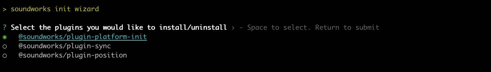
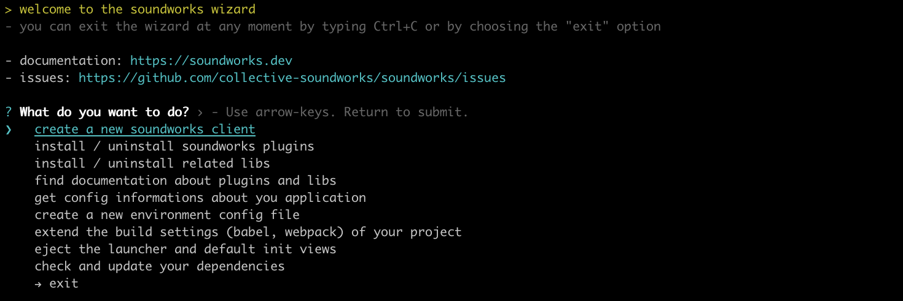
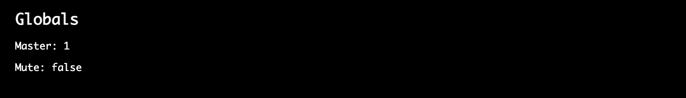

# The _Todo Noise_ Application

In this tutorial we will build a simple application, which shows the most common type of distributed interaction: i.e. remote monitoring and control, you will need to implement your own application.

The tutorial requires basic knowledge of the `soundworks` [state manager](./state-manager.html) and of the [platform-init plugin](./plugin-platform-init.html), so please refer to the relevant tutorials if you didn't check them yet.

Along the way, we will see how to create our own reusable [Web Components](https://developer.mozilla.org/en-US/docs/Web/API/Web_components) using the [Lit](https://lit.dev/) which is the default view framework used by soundworks.

### Relevant documentation and links

- [client.StateManager](https://soundworks.dev/soundworks/client.ContextManager)
- [client.SharedState](https://soundworks.dev/soundworks/client.SharedState)
- [server.StateManager](https://soundworks.dev/soundworks/server.StateManager)
- [server.SharedState](https://soundworks.dev/soundworks/server.SharedState)
- [client.PluginManager](https://soundworks.dev/soundworks/client.PluginManager)
- [server.PluginManager](https://soundworks.dev/soundworks/server.PluginManager)
- [@soundworks/plugin-platform-init](https://github.com/collective-soundworks/soundworks-plugin-platform-init)
- [Web Components](https://developer.mozilla.org/en-US/docs/Web/API/Web_components)
- [Lit](https://lit.dev/)

## User Story

The application purposely privileges the point of view of a user in a working situation (i.e. developer, designer, composer or performer) rather than the point of view of the end user (e.g. participant, audience). Indeed, while the later is generally be very specific to the application or artwork, the former generally requires properties and features that are quite common. As such the application is composed of two different types of clients: the `player` and the `controller`

The `player` can be envisioned as the client dedicated to the end users. The application can accept any number of players and each player has access to the following fonctionalities:
- It can trigger a sound.
- It can start and stop a synthesizer.
- It can update a parameter (i.e. a volume).

The `controller` is dedicated to the user in working situation, be it during the creation or the performance of the artwork. The application can accept any number of controllers and each of them has access to the following fonctionalities:
- It controls global parameters of the application (i.e. mute, master volume). These globals parameters must indeed be synchronized across every clients of the application (i.e. player and controller).
- It can take full control over any `player`, i.e. the change the volume, trigger a sound and change the state of the synthesizer.

This minimal set of functionalities should provide you a good overview of several important and recurring patterns of real-time distributed audio applications.

## Scaffolding the application

First thing first, let's generate a new empty application with the `@soundworks/create` wizard:

:::info
If needed, refer to the [getting-started](/tutorials/getting-started) page to learn more on how to run the wizard
:::

```sh
cd /path/to/working/directory
npx @soundworks/create@latest todo-noise
```

You can already select the [`@soundworks/plugin-platform-init`](https://github.com/collective-soundworks/soundworks-plugin-platform-init) plugin to have it installed. 



Then, when the wizard asks you for the name of the default client, just call it `player` (with the `browser` target and the `default` template). 


Once the wizard ended, let's launch the `soundworks` development tools inside our application and select the "create a new soundworks client" option to create our second `controller` client:

```sh
cd todo-noise
npx soundworks
```



The devtool wizard will ask you for the same questions as when you just created the `player` client. This time call the client `controller`, choose the `browser` target and the `controller` template. Select `no` when the tool asks if the client should be used as default:


:::tip
Selecting a client as the default means the client will be accessible at the root of the domain, which is more simple if you want to share an url with the public for example). In the other case the name of the client will be used as the route to access it. 

For example, in our application the `player` client would be accessible at `http://my-domain.com` while the `controller` client would be accessible at `http://my-domain.com/controller`
:::

Once done, we can exit the command-line devtool by typing `Ctrl+C` or by choosing the "exit" option.

Now that our project is scaffolded, let's create the schemas describing the states for each `player` as well as the global state.

## Creating and using the shared `globals` state

As mentionned in the user story, the application rely on 2 types of schema: 
- A schema that is tied to each connected player, i.e. each `player` client will create its own state instance from this schema.
- A schema defining global variables of the application (e.g. mute, master volume) which will be unique and shared by every connected clients.

Let's start by defining and creating the global schema. Create a new file named `globals.js` in the `src/server/schemas/` directory, and fill it with the following code:

```js
// src/server/schemas/globals.js
export default {
  master: {
    type: 'float',
    default: 1,
    min: 0,
    max: 1,
  },
  mute: {
    type: 'boolean',
    default: false,
  },
};
```

The global state derived from this schema will keep track of the master volume applied to all connected `player` clients (i.e. a gain between 0 and 1), and wether they are is muted or not.

Once done, let's instaciate the shared `globals` state on the server and attach all clients (i.e. `players`s and `controller`s to it).

### Create the shared instance

First let's create the shared instance on the server:

1. Import the schema in `src/server/index.js`:

```js {5}
// src/server/index.js
import { loadConfig } from '../utils/load-config.js';
import '../utils/catch-unhandled-errors.js';

import globalsSchema from './schemas/globals.js';
```

2. Register the schema into the state manager and create the `globals` state instance:

```js {4-5,8-10}
// src/server/index.js
const server = new Server(config);
server.useDefaultApplicationTemplate();
// register the globals schema
server.stateManager.registerSchema('globals', globalsSchema);

await server.start();
// create the shared globals state instance
const globals = await server.stateManager.create('globals');
console.log(globals.getValues());
```

Let's now start our server using `npm run dev`, you should see the current default values of the state logged in the terminal:


### Attaching the `globals` state to `player` clients

Let's now attach all our `player` clients to the shared state. For now we will only display its current values on the screen and will keep the actual audio code for later. 

To attach to the `globals` state, write the following snippet in the `src/clients/player/index.js` file:

```js {4}
// src/clients/player/index.js
await client.start();

const globals = await client.stateManager.attach('globals');
```

Then, import the `html` templating function from the [Lit](https://lit.dev/) library and add a simple debugging component to the layout that we will render each time the state is updated:

```js {3}
// src/client/player/index
import launcher from '@soundworks/helpers/launcher.js';
import { html } from 'lit';
```

```js {5-16}
// src/client/player/index
const globals = await client.stateManager.attach('globals');
const $layout = createLayout(client, $container);

// add simple log component to the layout
$layout.addComponent({
  render: () => {
    return html`
      <h2>Globals</h2>
      <p>Master: ${globals.get('master')}</p>
      <p>Mute: ${globals.get('mute')}</p>
    `;
  }
});
// update the view each time the globals state is changed
globals.onUpdate(() => $layout.requestUpdate());
```

If you open a player client at [`http://127.0.0.1:8000`](http://127.0.0.1:8000) you should now see the following:



### Controlling the `globals` from the `controller` clients

Now that everything is setup on the `player` side, let's implement our `controller` client to be able to control the `globals` state on all connected clients. Similarly to the `player` clients, let's first open the `src/clients/controller/index.js` and attach to the `globals` state:

```js {4}
// src/client/controller/index.js
await client.start();

const globals = await client.stateManager.attach('globals');
```

Then let's install the [`@ircam/simple-components`](https://ircam-ismm.github.io/simple-components/) library and create our control interface. 
First let's go back to the Terminal, close our development server using `Ctrl+C`,  install the library and restart the server:

```sh
npm install --save @ircam/simple-components
npm run dev
```

:::info
You could also use the `soundworks` devtool to install the library, be aware that the devtool will launch the exact same `npm` command under the hood.
:::

Now that the library is installed, let's import the components we need (i.e. text, slider and toggle) into our controller's `index.js` file:

```js {4-6}
// src/client/controller/index.js
import createLayout from './views/layout.js';

import { html } from 'lit';
import '@ircam/simple-components/sc-text.js';
import '@ircam/simple-components/sc-slider.js';
import '@ircam/simple-components/sc-toggle.js';
```

And finally, add the control component to the layout to control the `globals` shared state:

```js {5-31}
// src/client/controller/index.js
const globals = await client.stateManager.attach('globals');
const $layout = createLayout(client, $container);

// add a control component to the layout
$layout.addComponent({
  render: () => {
    return html`
      <h2>Globals</h2>
      <div style="padding-bottom: 4px">
        <sc-text value="master" readonly></sc-text>
        <sc-slider
          min=${globals.getSchema('master').min}
          max=${globals.getSchema('master').max}
          value=${globals.get('master')}
          width="400"
          @input=${e => globals.set({ master: e.detail.value })}
        ></sc-slider>
      </div>
      <div style="padding-bottom: 4px">
        <sc-text value="mute" readonly></sc-text>
        <sc-toggle
          ?active=${globals.get('mute')}
          @change=${e => globals.set({ mute: e.detail.value })}
        ></sc-toggle>
      </div>
    `;
  }
});
// update the view when the globals state change
globals.onUpdate(() => $layout.requestUpdate());
```

Now if you open a `player` ([`http://127.0.0.1:8000`](http://127.0.0.1:8000)) and a `controller` ([`http://127.0.0.1:8000/controller`](http://127.0.0.1:8000/controller)) in two different windows side by side you should how you can remote control all `player`s from a central controller:


## Creating and using the `player` state

As defined in our user story, we also want the clients to have some controls on their own interface, but importantly we want to be able to take control on any client remotely to simplify and fasten our development and creation process.

:::tip
Indeed, one you start working with several physical devices (e.g. smartphones, tablets), being able to control each of them from a single point can save you a lot of time, which will be better used to improve your artwork and experience. 
:::

To that end, let's first create and register another schema, from which we will create a new state for each connected players. So let's create a new `src/server/schemas/player.js` file with the following snippet:

```js
// src/server/schemas/player.js
export default {
  ìd: {
    type: 'integer',
    default: null,
    nullable: true,
  },
  frequency: {
    type: 'integer',
    default: 200,
    min: 50,
    max: 2000,
  },
  synthStart: {
    type: 'boolean',
    default: false,
    immediate: true,
  },
  synthTrigger: {
    type: 'boolean',
    event: true,
    immediate: true,
  },
};
```

Then register the schema in the server's stateManager:

```js {3,8}
// src/server/index.js
import globalsSchema from './schemas/globals.js';
import playerSchema from './schemas/player.js';

// ...

server.stateManager.registerSchema('globals', globalsSchema);
server.stateManager.registerSchema('player', playerSchema);
```

This values contains in these states will allow us to implement two different types of synthesizer with very common behavior: one which can be started and stopped (e.g. playing a sound file in a loop, see `synthStart`) and a second that is triggered by an event (see `synthTrigger`). To keep the audio code simple and focus on the architecture and the logic of the application we will create very simple synthesizers based on oscillators and use the same `frequency` value for the two synths.

:::tip
Note the `immediate` attribute for the `synthStart` and `synthTrigger` which one of the different behavior that can be twicked in shared states. In this case `immediate` means that the value is propagated locally before being propagated on the network to keep the latency and responsiveness of the interface to the minimum. See the different [schema type definitions](https://soundworks.dev/soundworks/server.StateManager.html#~schema) for more informations.
:::

So let's first create a new `player` state on each `player` client. To that end, add the following snippet in `src/clients/player/index.js`:

```js {5-7}
// src/clients/player/index.js
await client.start();

const globals = await client.stateManager.attach('globals');
const player = await client.stateManager.create('player', {
  id: client.id,
});
```

The second argument passed the `stateManager.create` method allows to define initialization values to the state. Here we pass the `client.id` generated by `soundworks` to the state so we can very simply track which state is bound to which client.

Then, let's create the `player` interface that we will...

To be continued


