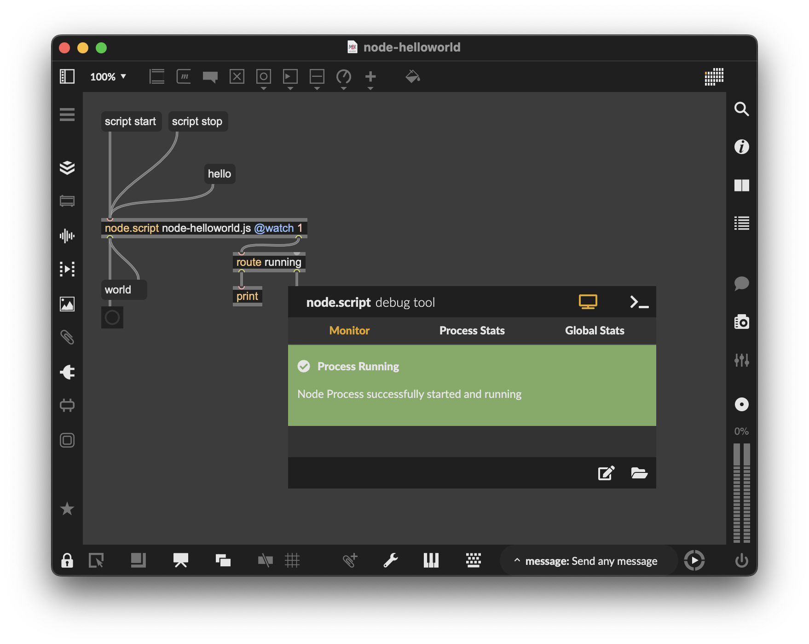

# Working with Max

In this recipe example we will explore how to use _soundworks_ in the _Max (Cycling '74)_ environement and learn why we need to keep some specific manoeuver in mind in order to make our applications fully working and stable.

In the [Working with Node Clients](https://soundworks.dev/tutorials/node-clients.html) tutorial, we explored the possibilites to work outside Web Browsers using Node.js. This enables the use of _soundworks_ in a large set of use. The _Max_ app encapsulates a _node.script_ object that will allow us to run _soundworks_ clients inside a _patch_.

To illustrate such possibilities, we will create a simple _soundworks-max_ application using the _soundworks_ wizard that will be your base skeleton for your own projects!

### Prerequisites
- [Node.js 16+](https://nodejs.org/en/)
- [Max 9+](https://cycling74.com/downloads) or [Live Suite 12+](https://www.ableton.com/)

### Related documentation

- [Max](https://docs.cycling74.com/)
- [soundworks](https://soundworks.dev/soundworks/)

## Scaffolding Application

Open a terminal and go to your projects directory :

```sh
cd path/to/your/projects/folder
```

Create your app directory and go into it :

```sh
mkdir my-super-app
cd my-super-app
```

As well as in tutorials, we will use the _soundworks_ wizard in order to scaffold the application. This will create a skeleton with a _js_ template specifically adapted to the _Max_ environment as well as his associated _patch_.

```sh
npx @soundworks/create@latest working-with-max
```

When the wizard asks you for plugins and libraries, just skip steps using `enter`.

Then, when the wizard asks you for the configuration of the default client:
- Name it `helloworld`
- Select the `node` target
- Select the `max` template

```ansi
# Create client
✔ Name of your new client (lowercase, no-space): … helloworld
✔ Which runtime for your client? › node
✔ Which template would you like to use? › max (`node.script`)

- Creating client "helloworld" in file "src/clients/helloworld.js"
- name: helloworld
- runtime: node
- template: max

? Confirm? › no / yes
```

After confirming, it will ask you where you would like to create your associated _Max patch_. This is a rather important information since during the installation process, a folder including a _Max patch_ template and a _js_ file pointing at the _soundworks_ app will be created.

:::info
Since the wizard runs inside the _soundworks_ app you are creating, the path you write here is a relative path to your patches from your _soundworks_ app main directory. We will have a tour on the architecture later in this recipe.
:::

Create the directory at the root of your app directory (one step behind the _soundworks_ app) : 

```ansi
Where should we create your Max patch? (leave blank to use current directory) › ../my-max-patches
```

You can then exit the wizard :

```ansi
? What do you want to do? › - Use arrow-keys. Return to submit.
    create a new soundworks client
    install / uninstall soundworks plugins
    install / uninstall related libs
    find documentation about plugins and related libs
    get config information about you application
    create a new environment config file
    eject the launcher and default views from `@soundworks/helpers
    check and update your dependencies
    upgrade config files from JSON to YAML
❯   → exit
```

To make sure the app is correctly set-up, juste go into the _soundworks_ project directory and run the app in dev mode :

```sh
cd working-with-max
npm run dev
```

Then, open the _patch_ and click on the `script start` message box. You should see the _Node for Max debug tool_ turning green with _process running_ message. If you click on the `hello` message box, the object should answer `world`.



You have a fully working _soundworks_ app with a client running in _Node for Max_!

## Architecture

Let's now have a look at your project's architecture and what was created by the wizard :

```sh
my-super-app
├── working-with-max              # Soundworks directory (where you do soundworks stuff)
│   ├── src
│       └── clients
│           └── helloworld.js     # Your client script (the one you edit)
│   ├── public
│   ├── node_modules
│   └── config
├── my-max-patches                # Max directory (where you do Max stuff)
│   ├── node-helloworld.maxpat    # A patcher skeleton with a node.script object 
│   └── node-helloworld.js        # The script used in your Max patch acting as a 'bridge'
                                  # to the soundworks app (should remain unchanged)
```

You might now wonder why we are using a 'bridge script'. If you take a closer look at the _node.script_ object in the _Max_ documentation, you will see that :

> _"Node and Max can sometimes disagree about how folder should be organized"_

For that matter, the _script_ instanciated by the _node.script_ _Max_ object should always remain in the same directory than your _patch_.

If for some reason you would like to move the _patches_ directory, it is essential to keep in mind that you will also have to change the relative path to the _soundworks_ app inside the associated script in `/my-max-patches/node-helloworld.js` :

```js
// change process.cwd() to soundworks application root
process.chdir('../working-with-max');
```

:::info
The _patch_ and the script should **always** remain in the same directory!
:::

However, a good practice would be for example to use this _patch_ as an _abstraction_, and have the entire directory in your _File Preferences'_ path in _Max_.

## What's different in the _soundworks_ app

Let's now have a look at the _soundworks_ app to see what have changed when specifying that you wanted to create a _node_ script as _Max_ template.

In fact, apart from the client you created in `/src/clients/` as a _Max_ template, nothing have changed. Let's have a closer look at the changes in this template :

1. An import to use the max api in node
```js
import Max from 'max-api';
```
2. Access to an `ENV` variable to be able to change your config 
```js
const ENV = 'default';
```
3. Since it does not make any sense to emulate clients in _Node for Max_, there is no bootstrap function as you could see in a regular _soundworks_ client.

