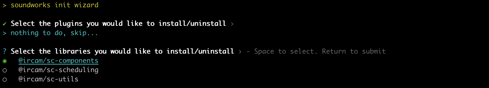
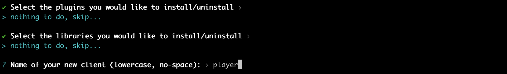
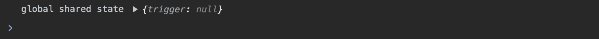

# Getting Started

In this tutorial, we will learn how to setup a project and develop a simple _soundworks_ application where any connected user will be able to trigger a flash on the screen of all connected clients.

The tutorial requires basic knowledge of _JavaScript_, _Node.js_ and of the command-line. If you are just starting with _JavaScript_ development, please first set up a working environment following the instructions [here](/misc/setting-up-environment.html) and come back when done.

### Prerequisites

- [Node.js 16+](https://nodejs.org/en/)
- A modern browser (e.g. Chrome, Firefox)

<!-- [[toc]] -->

## Step 1 - Setting things up

The best and most simple way to create a new _soundworks_ application is to use our dedicated command line tools: 


So first thing first, open a Terminal, go to some directory and execute the following command:

```sh
cd path/to/working/dir
npx @soundworks/create@latest
```

::: tip
If you run the command for the first time (which is quite likely), the `npx` command will tell you that it needs to install the `@soundworks/create` package, just press `Enter` to accept and continue.
:::

The wizard will startup and ask you for the name of the directory in which you want create the application: just write `getting-started` and press `Enter`. The wizard will automatically create the directory, copy a bunch of files and install the required dependencies as illustrated in the screenshot below.

::: info
Note that the screenshots in this guide may differ slightly from what you actually see in your console, as the CLI tool might have evolved a bit since the screenshots have been made.
:::


Once the installation is done, the `@soundworks/create` wizard will propose you to install some _soundworks_ plugins and some curated libraries. For now, just press `Enter` to skip this steps.



After that step, the wizard will propose you to create a client of your application. Let's call it `player` and press `Enter` as show below.



The wizard will then ask a few questions to configure your client, again just press `Enter` to select the default values (i.e. type: `browser` and template: `default`):


Finally, the wizard will ask you to confirm your choices, press `Enter`.


The wizard will copy some files and configure the application for you. Your application is ready to be launched.

To make sure the application is correctly set up and installed, just follow the steps 1 and 3 proposed as next steps by the wizard.


So:
1. Go to the directory: `cd getting-started`
2. Optionally create a git project: `git init && git add -A && git commit -m "first commit"`
3. Launch the project in development mode: `npm run dev`

After a few seconds, the server should be running:


Open you favorite browser (which shall probably not be Safari), go to [http://127.0.0.1:8000](http://127.0.0.1:8000), and tada! You should see a rather pretty almost black screen:


Congrats! You just configured and ran your first soundworks application. Now, let's have a closer look to the codebase.

## Step 2 - Exploring the file structure of the application

Press `Ctrl + C` to stop the server and open the `getting-started` directory in your favorite text editor. You should see the following file structure:

```sh
getting-started
├── .build              # Directory where your application is built
├── config              # Configuration files
│   └── application.json  
├── node_modules        # Directory where all dependencies are installed
├── public              # Directory that is exposed by the server
├── src
│   ├── clients         # Directory where all clients are declared
│   │   ├── components  
│   │   ├── player      # Source code of the `player` client you just created
│   │   └── styles
│   ├── server          # Source code of the server
│   └── utils   
├── package.json        # File that contains the declaration of your dependencies
└── README.md           # General infos about your application
```

There are a few thing to note about all these files:
- The `node_modules` and `.build` directories should **_never_** be edited manually. They are repspectively used by the Node Package Manager (i.e. `npm`) to install dependencies of your application, and by the _soundworks_ build tools to make some transformation on your source files.
- The `src` directory, at contrary, contains all the source files of your application, this is where you will work most of the time.
- The `public` directory is the directory that is exposed to the network by the server. This is the place where you should put your static assets such as images or sound files, so that clients connected to your application can download and use them. 

::: warning
It is **_very_** important to understand and to keep in mind that exposing a directory to the network means that **_all the files_** located in this directory will be accessible by **_any_** computer connected to the same network.  

**_So, DO NOT expose any sensitive or private information in this directory_**.  

This is an important thing to keep in mind whenever you deal with servers and networks, it's not specific to _soundworks_ applications.
:::

Now that we have overviewed the file structure of a _soundworks_ application, let's write some code!

## Step 3 - Create a global shared state

First, go back to the Terminal and restart the server:

```sh
npm run dev
```

:::tip
The `dev` command (quite wisely) starts the server in development mode. This means the application will be bundled and the server restarted each time a source file is saved (which is expected to be confortable and time saving when developping an application).
:::

Open the `src/server/index.js` file and add the following lines at the end of the file:

```js {5-7}
// src/server/index.js
await server.start();

// and do your own stuff!
const globalSchema = {
  trigger: { type: 'boolean', event: true },
};
```

Here, we are just creating a plain old JavaScript object that follows the _soundworks_ schema definition. This data structure declares a parameter named `trigger` that is configured to be a `boolean` event.

::: tip
If you are familiar with databases, you can think of these data structure as the schema of a table. 
If you are curious, the full API documentation for declaring schemas can be found [here](https://soundworks.dev/soundworks/server.StateManager#~schema).
:::

Then we need to register this schema declaration into the _soundworks_' state manager:

```js {5}
const globalSchema = {
  trigger: { type: 'boolean', event: true },
};

server.stateManager.registerSchema('global', globalSchema);
```

Finally, we can create a global shared state instance from this schema definition:

```js {7}
const globalSchema = {
  trigger: { type: 'boolean', event: true },
};

server.stateManager.registerSchema('global', globalSchema);

const global = await server.stateManager.create('global');
```

And, that's it for the server-side logic! 

If everything went well, you should see no error in the Terminal, and launching a [client in your browser](http://120.0.0.1:8000) should still show you the same fancy black page.

## Step 4 - Make clients interactive

Now that the server-side logic is ready, let's implement the client-side of our simple application.

Open a browser and go to [http://127.0.0.1:8000](http://127.0.0.1:8000), then go back to your text editor and open the `src/clients/player/index.js` file.

First, let's change a line of code to modify the text on the page to make sure we can act on this fancy black screen:

```js
// src/clients/player/index.js
await client.start();

render(html`
  <div class="simple-layout">
    <p>Hello ${client.config.app.name}!</p> // [!code --]
    <p>Click here</p>  // [!code ++]

    <sw-credits .infos="${client.config.app}"></sw-credits>
  </div>
`, $container);
```

If you reload the page (`Cmd + Shift + R`), you should now see the text "click here" displayed of the top left of your screen.

::: tip
The HTML rendering is done here using the [lit](https://lit.dev/) library developped by _Google_. 

While we promote usage of this library in the default application template, _soundworks_ does not require usage of this library and could potentially be used with any other library or framework.
:::

Now that we are sure everything works as expected and that we have control over the behavior of this Web page, let's add the following code in the same file:

```js {4-5}
// src/clients/player/index.js
await client.start();

const global = await client.stateManager.attach('global');
console.log('global shared state', global.getValues());

render(html`
  <div class="simple-layout">
    <p>Click here</p>
    <sw-credits .infos="${client.config.app}"></sw-credits>
  </div>
`, $container);
```

Here, we simply attach our client to the `global` state created by the server. This means that our client will be able 1. to apply some updates to the shared state, and 2. to be notified when a change is made to the shared state from another client on the network.

The second line will just log the current values of the `global` shared state into the browser's console, so that we can make sure that the `global` shared state has been successfully attached.



:::tip
To open the _JavaScript_ console in your browser, you should press `Cmd + Alt + J` in 
_Chrome_ or `Cmd + Alt + I` in _Firefox_, then select the `Console` tab.
::: 

Now that our shared state is attached, let's write the code that allows us to react to any change made on the shared state:

```js {6-8}
await client.start();

const global = await client.stateManager.attach('global');
console.log('global shared state', global.getValues());

global.onUpdate(updates => {
  console.log(updates);
});
````

In this snippet, we use the `onUpdate` method of the `global` shared state that allows us to register a function to be executed when something is update on the state. For now, the callback function will just log the updates in the console, but we will come back there later on to do something more fancy.

At this point, we have all the logic we need to react to a change in the `global` shared state, but nothing to actually trigger a change. So, let's now add the following code to update the value of the `trigger` parameter when the user clicks on the screen:

```js {10-12}
await client.start();

const global = await client.stateManager.attach('global');
console.log('global shared state', global.getValues());

global.onUpdate(updates => {
  console.log(updates);
});

$container.addEventListener('click', () => {
  global.set({ trigger: true });
});
```

Reload the page again (`Cmd + Shift + R`), and click anywhere on the screen, you should see a new log appear in the console on each click.


Finally, let's just review the code inside the `onUpdate` callback function to change the color of the screen, instead of just logging into the console.

```js {6-12}
await client.start();

const global = await client.stateManager.attach('global');

global.onUpdate(updates => {
  if (updates.trigger === true) {
    $container.style.backgroundColor = 'white';

    setTimeout(() => {
      $container.style.backgroundColor = 'black';
    }, 50);
  }
});
```

Now, whenever the `trigger` parameter of the `global` shared state is set to `true`, we change the background color of the screen to `'white'` and put it back to `'black'` after 50ms.

To see the shared state in action, and understand more precisely why we keep calling it a "_shared state_", let's emulate several parallel browser clients in our browser window. To that end, open [http://127.0.0.1:8000?emulate=8](http://127.0.0.1:8000?emulate=8) (note the `?emulate=8` at the end of the URL). 


If you click on any of these 8 emulated clients, all of them will blink. Indeed all of them are attached to the same `global` shared state, and react exactly in the same way to the updates of the state.

## Conclusion

Congrats, you just wrote your first _soundworks_ application. Along the way you learned quite a few things: 
- 1. How to setup a _soundworks_ application using the `@soundworks/create` wizard, 
- 2. How to use some of the tools that are at your end to simplify development
- 3. Discovered the shared states provided by _soundworks_, and how they allow you to simplify development and to hide lots of network complexity.

On the next tutorial, we will explore more possibilities proposed by the _soundworks_' distributed state management system.

