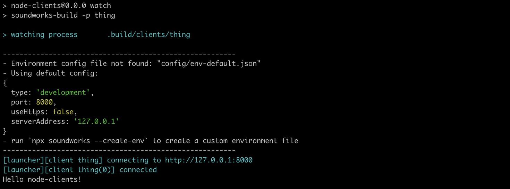
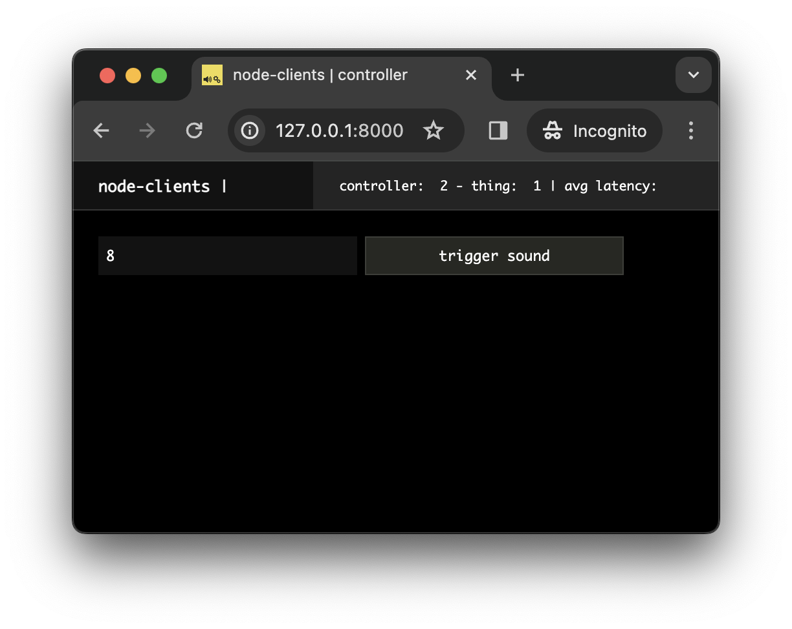
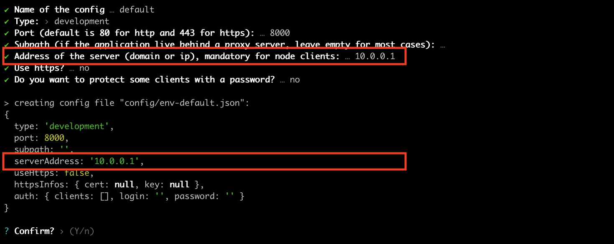

# Working with Node Clients

In this tutorial, we will explore how to use _soundworks_ to create clients that run within a _Node.js_ process, opening new possibilities of creating application outside Web Browsers.

Indeed, this functionality allows to create applications that can work in screen less embedded hardware, such as the Raspberry Pi, allowing to access some functionalities, such as controlling a motor or a LED, which are hard to achieve in sandboxed environment that are Web browsers.

To illustrate this possibility and discover some of the tools you have at hand to help you, we will build a very simple application where a browser controller client can trigger a sound synthesized by another client running in a Node.js process.

### Related Documentation

- [soundworks Client](https://soundworks.dev/soundworks/client.html)
- [node-web-audio-api](https://github.com/ircam-ismm/node-web-audio-api)

## Scaffolding Application

Let's start with scaffolding our application:

```sh
cd path/to/tutorials
npx @soundworks/create@latest node-clients
```

When the wizard asks you to create the default client, let's just create a browser client with the "controller" template (we will create our _Node.js_ client afterward):


Then let's start our application with:

```
cd node-clients
npm run dev
```

## Implementing the control logic

Before implementing our _Node.js_ client, let's use the features we have learned so far so that our controller can trigger a sound on any of our future _Node.js_ clients.

Let's start with defining the state we will call `thing`, that will be created by our _Node.js_ clients when they connect to the application. Create a file named `thing.js` in `src/server/schemas` and declare the following schema definition:

```js
// src/server/schemas/thing.js
export default {
  id: {
    type: 'integer',
    default: null,
    nullable: true,
  },
  triggerSound: {
    type: 'boolean',
    event: true,
  },
};
```

Now that our schema is declared, let's just import it into our server index file and register it into our server state manager:

```js
// src/server/index.js
import { loadConfig } from '../utils/load-config.js';
import '../utils/catch-unhandled-errors.js';
// import the schema of our thing client
import thingSchema from './schemas/thing.js'; // [!code ++]

// ...

const server = new Server(config);
// configure the server for usage within this application template
server.useDefaultApplicationTemplate();
// register the schema into the state manager
server.stateManager.registerSchema('thing', thingSchema); // [!code ++]

await server.start();
```

Now let's go to our controller to, first, create a collection of our "thing" states:

```js
// src/clients/controller/index.js
await client.start();

// create the collection and update the GUI on every collection event
const thingCollection = await client.stateManager.getCollection('thing'); // [!code ++]
thingCollection.onUpdate(() => renderApp()); // [!code ++]
thingCollection.onAttach(() => renderApp()); // [!code ++]
thingCollection.onDetach(() => renderApp()); // [!code ++]

function renderApp() {
  // ...
}
```

And 2. modify the `renderApp` function to create a simple graphical control interface:

```js
function renderApp() {
  render(html`
    <div class="controller-layout">
      <header>
        <h1>${client.config.app.name} | ${client.role}</h1>
        <sw-audit .client="${client}"></sw-audit>
      </header>
      <section>
        <p>Hello ${client.config.app.name}!</p> // [!code --]
        ${thingCollection.map(thing => { // [!code ++]
          return html` // [!code ++]
            <div> // [!code ++]
              <sc-text>${thing.get('id')}</sc-text> // [!code ++]
              <sc-button // [!code ++]
                @input=${e => thing.set({ triggerSound: true })} // [!code ++]
              >trigger sound</sc-button> // [!code ++]
            </div> // [!code ++]
          `; // [!code ++]
        })} // [!code ++]
      </section>
    </div>
  `, $container);
}
```

Of course if you launch the controller ([http://127.0.0.1:8000/](http://127.0.0.1:8000/)) right now, the screen will be empty but everything is now ready to create and control our node clients.

## Implementing the _Node.js_ client

Let's shutdown our server (`Ctrl + C`) for a while to launch a few commands. 

First let's install a node package that will allow us to write Web Audio code into _Node.js_:

```sh
npm install --save node-web-audio-api
```

::: info
The [`node-web-audio-api`](https://github.com/ircam-ismm/node-web-audio-api) package is the re-implementation of the Web Audio API specification to be used within Node.js written in the `Rust` language. The package is relatively recent and does not expose yet all the features, such as `AudioWorklet`, you would expect in Web browsers. However, it already offers interesting compatibility and descent performances which makes it usable in a (hopefully) quite large spectrum of projects.

For those who might be interested in using the library directly in a `Rust` project, see [web-audio-api-rs](https://github.com/orottier/web-audio-api-rs)
:::

Then let's create our second client:

```sh
npx soundworks --create-client
```

with "thing" as name and "node" as target:


Once done, you can restart the development server:

```sh
npm run dev
```

To launch our node client, let's open a second "Terminal", and run the following commands:

```sh
# go to the node-clients tutorial directory
cd path/to/tutorials/node-clients
# run you newly created node client in watch mode
npm run watch thing
```

And tada! Your node client should now be connected to the server:



Now that everything is setup and ready, let's write the code needed so our node clients react to the instructions from the controller and play some sound.

First, let's thus create our "thing" state and initialize its `id` field with the id of the _soundworks_ client. Open the `src/clients/thing/index.js` file and add the following snippet:

```js
await client.start();
// create the thing state and initialize it's id field // [!code ++]
const thing = await client.stateManager.create('thing', { // [!code ++]
  id: client.id, // [!code ++]
}); // [!code ++]
// react to updates triggered from controller // [!code ++]
thing.onUpdate(updates => { // [!code ++]
  if ('triggerSound' in updates) { // [!code ++]
    console.log('make some noise!'); // [!code ++]
  } // [!code ++]
}); // [!code ++]

console.log(`Hello ${client.config.app.name}!`);
```

::: info
If you go see the "Terminal" in which you launched your node client, you can see that the client automatically restarted each time you saved a file, just as with the server. This is the goal of the `npm run watch [process_name]` command.
::: 

If you go back to your controller, you should now see the interface updated with your connected client:


And if you click on the "trigger sound" button, the "make some noise!" should in turn appear in the terminal where you launched your _thing_ client:


Let's finally write our Web Audio code so that a sound is actually triggered from the _Node.js_ process:

```js
// src/clients/thing/index.js
import { Client } from '@soundworks/core/client.js';
import launcher from '@soundworks/helpers/launcher.js';
// import some classes from the node-web-audio-api package // [!code ++]
import { AudioContext, GainNode, OscillatorNode } from 'node-web-audio-api'; // [!code ++]

// ...

const thing = await client.stateManager.create('thing', {
  id: client.id,
});
// register audioContext
const audioContext = new AudioContext(); // [!code ++]

// react to updates triggered from controller
thing.onUpdate(updates => {
  if ('triggerSound' in updates) {
    console.log('make some noise!'); // [!code --]
    const now = audioContext.currentTime; // [!code ++]
 // [!code ++]
    const env = new GainNode(audioContext, { gain: 0 }); // [!code ++]
    env.connect(audioContext.destination); // [!code ++]
    env.gain.setValueAtTime(0, now); // [!code ++]
    env.gain.linearRampToValueAtTime(1, now + 0.01); // [!code ++]
    env.gain.exponentialRampToValueAtTime(0.0001, now + 1); // [!code ++]
 // [!code ++]
    // randomly pick one of harmonics of a sound at 50Hz // [!code ++]
    const frequency = Math.floor(Math.random() * 10) * 50 + 50; // [!code ++]
    const osc = new OscillatorNode(audioContext, { frequency }); // [!code ++]
    osc.connect(env); // [!code ++]
    osc.start(now); // [!code ++]
    osc.stop(now + 1); // [!code ++]
  }
});
```

And that's all! You have now a simple _soundworks_ client that runs into _Node.js_ process and can trigger sound. 

As you can see, the code you wrote to create this client is exactly the same as the one you would have written in a browser client. Indeed, abstracting the platform in such manner is an important goal of _soundworks_ and of the related libraries, such as the `node-web-audio-api` package.

## Notes

### Emulating multiple clients

In the previous tutorial, we often used the `?emulate=6` query parameter in our URL to emulate several clients in only one browser window, which is very practical when developing a distributed application.

In a similar manner, this is also possible to run several node clients in the same terminal, for example run:

```sh
EMULATE=4 npm run watch thing
```

to launch four clients in parallel.

### Running node client on a network

Another important point to consider is that the node clients needs some configuration to be able to connect to the server. Indeed, when we launch a client in a browser we, as human, tell the browser where to reach the server when we write the URL in the address bar of the Web browser. 

However, node clients don't have any address bar, hence if your node client doesn't run into your computer but in a remote device, it will need a bit of configuration to know the IP address of the server. To that end, you can launch the following command to create a environment config file that node clients will be able to consume:

```sh
npx soundworks --create-env
```



A future tutorial will explain in more detail how to configure a soundworks application in a production setting.

## Conclusion

In this tutorial, we have explored an important feature of _soundworks_, i.e. the possibility to create clients that are not running in a Web browser, but rather in a _Node.js_ process.

In the next tutorials, we will continue our journey into _soundworks_, by tackling the important question of synchronization between different processes and machines.


