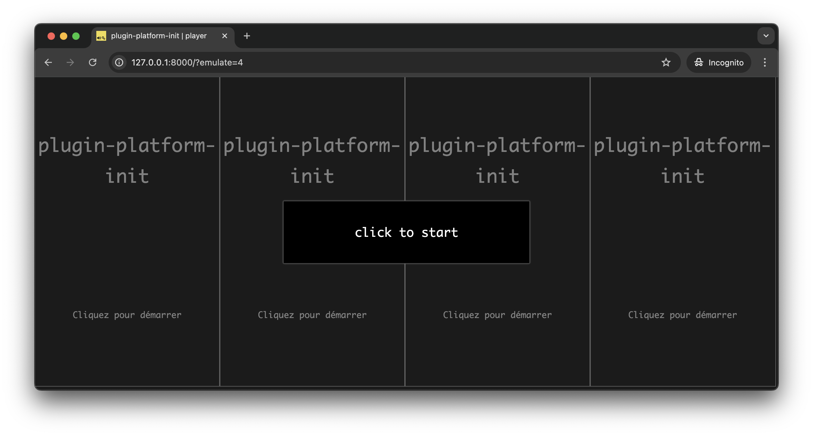

# Using Plugins 1 - The _platform-init_ Plugin

In this first tutorial on _soundworks_ plugins, we will learn why and how to use the _platform-init_ plugin, which aims to simplify the use of certain browser features, such as the Web Audio API, that require a user gesture to be properly initialized.

The tutorial requires basic knowledge of the `soundworks` wizard, so please refer to the [getting started tutorial](/tutorials/getting-started) if you didn't check it yet.

> The final source code of this tutorial can be found [here](https://github.com/collective-soundworks/tutorials/tree/main/plugin-platform-init)

### Relevant documentation

- [ClientPluginManager](https://soundworks.dev/soundworks/ClientPluginManager)
- [ServerPluginManager](https://soundworks.dev/soundworks/ServerPluginManager)
- [@soundworks/plugin-platform-init](/plugins/platform-init.html)

## Scaffolding the application and installing the plugin

First thing first, let's generate a new empty application with the `@soundworks/create` wizard. When the wizard will ask you to configure the default client, enter the following information:
- Name it `player`
- Select the `browser` target
- Select the `default` template

```sh
cd /path/to/working/directory
npx @soundworks/create@latest plugin-platform-init
```

```ansi
~/tmp $ npx @soundworks/create@latest plugin-platform-init
[@soundworks/create#v5.0.3]

> welcome to soundworks

- documentation: https://soundworks.dev
- issues: https://github.com/collective-soundworks/soundworks/issues


- Scaffolding application in "~/tmp/plugin-platform-init" directory
- Installing dependencies

[@soundworks/wizard#v5.0.3]

# Install plugins
✔ Select the plugins you would like to install/uninstall › 
+ nothing to do, aborting...

# Install libraries
✔ Select the libraries you would like to install/uninstall › 
+ nothing to do, aborting...

# Create client
✔ Name of your new client (lowercase, no-space): … player
✔ Which runtime for your client? › browser
✔ Which template would you like to use? › default

- Creating client "player" in file "src/clients/player.js"
- name: player
- runtime: browser
- template: default
- default: true

✔ Confirm? … no / yes
+ client player created and configured

  > welcome to the soundworks wizard
  - you can exit the wizard at any moment by typing Ctrl+C or by choosing the "exit" option

  - documentation: https://soundworks.dev
  - issues: https://github.com/collective-soundworks/soundworks/issues

✔ What do you want to do? › → exit
```


Once done, go to the directory and launch the `soundworks` wizard again to install the plugin:

```sh
cd plugin-platform-init
npx soundworks
```

Select the `install / uninstall soundworks plugins` entry with the arrows and press `Enter`:

```ansi
~/tmp $ cd plugin-platform-init/
~/tmp/plugin-platform-init $ npx soundworks
[@soundworks/wizard#v5.0.3]

  > welcome to the soundworks wizard
  - you can exit the wizard at any moment by typing Ctrl+C or by choosing the "exit" option

  - documentation: https://soundworks.dev
  - issues: https://github.com/collective-soundworks/soundworks/issues

? What do you want to do? › - Use arrow-keys. Return to submit.
    create a new soundworks client
❯   install / uninstall soundworks plugins
    install / uninstall related libs
    find documentation about plugins and libs
    get config information about you application
    create a new environment config file
    eject the launcher and default init views
    check and update your dependencies
    upgrade config files from JSON to YAML
    → exit

```

Select the `@soundworks/plugin-platform-init` using the space bar:

```ansi
✔ What do you want to do? › install / uninstall soundworks plugins

# Install plugins
? Select the plugins you would like to install/uninstall › - Space to select. Return to submit 
◉   @soundworks/plugin-platform-init
◯   @soundworks/plugin-sync
◯   @soundworks/plugin-filesystem
◯   @soundworks/plugin-scripting
◯   @soundworks/plugin-checkin
◯   @soundworks/plugin-position
◯   @soundworks/plugin-logger
```

And confirm:

```ansi
✔ What do you want to do? › install / uninstall soundworks plugins

# Install plugins
✔ Select the plugins you would like to install/uninstall › @soundworks/plugin-platform-init

> installing: @soundworks/plugin-platform-init
? Confirm? › no / yes
```

After the installation has completed, you can exit the wizard by pressing `Ctrl+C` or by selecting the `→ exit` entry in the menu.

::: info
You may have already noted that the wizard asks you if you want to install plugins when creating the application.

We just followed the long path to show you how to use the wizard within an existing application.
:::

::: info
Note that this specific functionality of the wizard is just a facade over `npm install`, it is exactly equivalent to doing:

```sh
npm install --save @soundworks/plugin-platform-init
```
:::

If you open the `package.json` file, you should see the `@soundworks/plugin-platform-init` package declared in the `dependencies`::

```json {5}
// package.json
"dependencies": {
  "@soundworks/core": "^5.0.0",
  "@soundworks/helpers": "^5.0.0",
  "@soundworks/plugin-platform-init": "^5.0.0",
  "lit": "^3.1.3"
},
```

This file allows you and the _node package manager_ (i.e. `npm`) to keep track of the dependencies of your project. Then, if you need to re-install the application dependencies (i.e. `npm install`) the plugin will be re-installed as well.

::: info
Note that the actual list of dependencies and version numbers might change compared with the ones listed above, as new versions of the core library and of the plugins will be released in the future.
:::

## Registering the plugin into _soundworks_

Now that the plugin is installed as a dependency of our application, let's write the code to register the plugin into _soundworks_.

Note that by design, all _soundworks_ plugins always come with both a server-side component and a client-side component. Hence, you will always have to register the plugin on both side of your application.

### Server-side registration

Let's start with the server-side part and write the following code in the `src/server.js` file. First let's import the server-side part of the plugin on top of the file:

```js
// src/server.js
import { Server } from '@soundworks/core/server.js';
import { loadConfig, configureHttpRouter } from '@soundworks/helpers/server.js';
// import the server-side part of the `platform-init` plugin
import ServerPluginPlatformInit from '@soundworks/plugin-platform-init/server.js'; // [!code ++]
```

Then register it into the `server.pluginManager` component:

```js
// src/server.js
const server = new Server(config);
configureHttpRouter(server);
// register the plugin into the soundworks' plugin manager
server.pluginManager.register('platform-init', ServerPluginPlatformInit); // [!code ++]
```

The [`ServerPluginManager.register`](https://soundworks.dev/soundworks/ServerPluginManager#register) method takes at least 2 arguments:
- A user defined `id` (here `platform-init`) that is used as an internal identifier to retrieve the plugin instance. In more advanced use-cases, it also allows you to register several times the same plugin under different ids.
- A plugin constructor (here `ServerPluginPlatformInit`) from which the actual plugin instance will be created.

And that's all for the server-side! Let's now install the plugin on the client-side.

### Client-side registration

Let's open the `src/clients/player.js` and, as for the server-side, import the client-side part of the _platform-init_ plugin:

```js
// src/clients/player.js
import { Client } from '@soundworks/core/client.js';
import { loadConfig, launcher } from '@soundworks/helpers/browser.js';
import { html, render } from 'lit';
// import the client-side part of the `platform-init` plugin
import ClientPluginPlatformInit from '@soundworks/plugin-platform-init/client.js'; // [!code ++]
```

Now that our plugin is imported, we can register it into the [`ClientPluginManager`](https://soundworks.dev/soundworks/ClientPluginManager):

```js
// src/clients/player.js
const config = loadConfig();
const client = new Client(config);
// register the plugin into the soundworks' plugin manager
client.pluginManager.register('platform-init', ClientPluginPlatformInit); // [!code ++]
```

As for the server-side, we passed 2 arguments to the [`ClientPluginManager#register`](https://soundworks.dev/soundworks/ClientPluginManager#register) method: the plugin user-defined `id` and the constructor of the plugin.

An important point to notice here is that the `id` we used is the same on both server-side and client-side. This allows _soundworks_ to automatically match and associate the two components.

At this point, if you start the server (i.e. `npm run dev`) and go to [http://127.0.0.1:8000](http://127.0.0.1:8000), you should see the default splash screen provided by the plugin. This screen requires a user gesture (i.e. a "click" event) and is automatically shown by the `launcher` because the _platform-init_ plugin has been registered into _soundworks_:


## Resuming an `AudioContext`

So far, so good but what we did until now is mainly to add a splash screen asking for a click, but does nothing particular... Or, as stated in the beginning of the tutorial, the whole aim of the `platform-init` plugin is to simplify the initialization of features that require a user-gesture in order to be properly launched. Let's exemplify that by resuming an `AudioContext`.

::: info
An user gesture is required by the browsers to access or initialize certain features such as the [Web Audio API](https://developer.mozilla.org/en-US/docs/Web/API/Web_Audio_API), the microphone or the camera. This is a way to protect end-users against intrusive ads and/or for obvious privacy reasons.
:::

So first, let's first create an new `audioContext`:

```js
// src/clients/player.js
const config = loadConfig();
const client = new Client(config);
const audioContext = new AudioContext(); // [!code ++]
```

And pass it as third argument of the `pluginManager.register` method:

```js {4-5}
// src/clients/player.js
const client = new Client(config);
// register the plugin into the soundworks' plugin manager, and pass it the audioContext
client.pluginManager.register('platform-init', ClientPluginPlatformInit);  // [!code --]
client.pluginManager.register('platform-init', ClientPluginPlatformInit, { audioContext });  // [!code ++]
```

:::info
By default, the _platform-init_ plugin provides simplified access to several features, such as motion sensors, microphone and camera. Refer to the [plugin documentation](https://github.com/collective-soundworks/soundworks-plugin-platform-init) for more information.
:::

Finally, let's create some welcoming sound that will show us that everything works well and that our `audioContext` is properly resumed:

```js
// src/clients/player.js
launcher.register(client, { initScreensContainer: $container });

console.log(`> before start - audioContext is "${audioContext.state}"`); // [!code ++]
await client.start();
console.log(`> after start - audioContext is "${audioContext.state}"`); // [!code ++]

const now = audioContext.currentTime;  // [!code ++]
// create a simple envelop // [!code ++]
const env = audioContext.createGain(); // [!code ++]
env.connect(audioContext.destination); // [!code ++]
env.gain.setValueAtTime(0, now); // [!code ++]
env.gain.linearRampToValueAtTime(0.5, now + 0.01); // [!code ++]
env.gain.exponentialRampToValueAtTime(0.0001, now + 4); // [!code ++]

const src = audioContext.createOscillator(); // [!code ++]
src.connect(env); // [!code ++] // [!code ++]
// randomly pick a frequency on an harmonic spectrum (150, 300, 450, etc...)  // [!code ++]
src.frequency.value = 150 + Math.floor(Math.random() * 10) * 150; // [!code ++]
src.start(now); // [!code ++]
src.stop(now + 4); // [!code ++]
```

Reload the page (`Cmd+R`) and click, you should now hear an incredibly nice sound coming from your speakers!

:::tip
Note that if you emulate multiple clients in the same window (i.e. [http://127.0.0.1:8000/?emulate=4](http://127.0.0.1:8000/?emulate=4)), you should see how the soundworks launcher also helps you to start all the clients at once without requiring you to click on each of them:


:::

## Notes on the `@soundworks/helpers` default views

The splash screen, as well as other default initialization views that we have not seen yet, are automatically created and handled by the `launcher` object included in the default application template:

```js
// src/clients/player.js
launcher.register(client, { initScreensContainer: $container });
```

The launcher offers numerous ways to adapt these views to your specific needs: e.g. to change the default styles, to adapt the language, or even to use completely different user defined views.

While we won't cover these advanced use-cases here, as they will be the subject of a dedicated tutorial, let's just see here the minimal changes we can make to customize the init view.

Let's then open the `config/application.yaml` file which should look like this:

```yaml
# config/application.yaml
name: plugin-platform-init
author: ""
clients:
  player:
    runtime: browser
    default: true
```

This file has been generated for you by the _soundworks_ wizard, and the `clients` entry is automatically updated each time you create a new client using this tool.

However, the `name` and `author` entries can be safely changed and are used by the `launcher` to create the splash screen. Let's just change the `name` and `author` entries to see it in action:

```yaml
name: plugin-platform-init // [!code --]
name: Hello Plugins // [!code ++]
author: "" // [!code --]
author: me & myself // [!code ++]
```

And tada! If you now go to [http://127.0.0.1:8000](http://127.0.0.1:8000) you should now see something like:


::: info
By default, the init views try to adapt to the locale of the browser and falls back to English if the localized texts do not exist. However, as we only provide English and French versions of the texts at time of writing the tutorial, it's very likely that you have seen the English version.

If you are comfortable with another language and are willing to contribute to a localized version of [this file](https://github.com/collective-soundworks/soundworks-helpers/blob/main/browser-client/i18n/en.js), please open an issue or a pull request in the [`@soundworks/helpers`](https://github.com/collective-soundworks/soundworks-helpers/) repository!
:::

## Conclusion

In this tutorial, you have learned the basics of _soundworks_ plugins usage, and more precisely how to use the _platform-init_ plugin. While this plugin is not _per se_ very complex, it can save you a lot of (quite boring) development time by simplifying the initialization of certain browser features. Along the way, you also discovered some of the functionalities provided by the `launcher` component that is automatically included in all _soundworks_ applications created with the wizard.

In the next tutorial, we will wrap up what we have learned so far by creating a small working application where several clients can be used as distributed speakers from a central controller.


