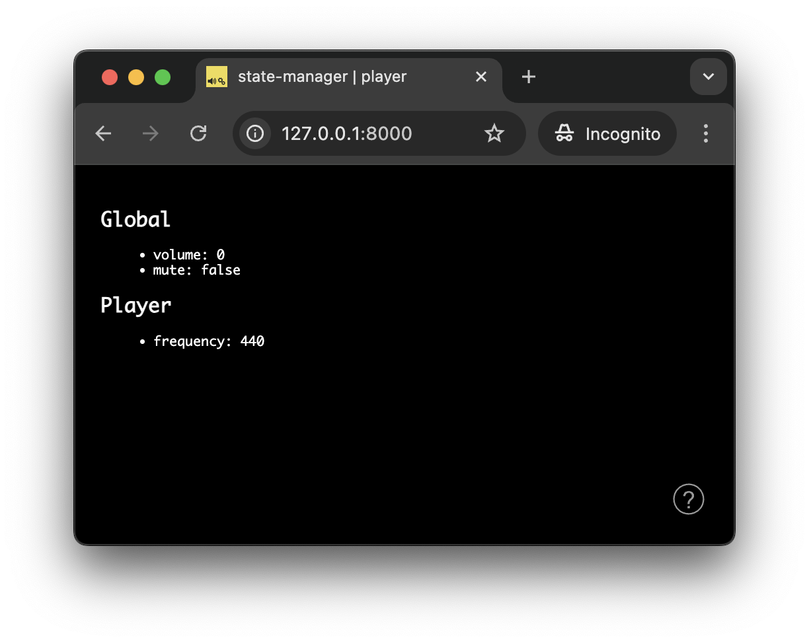
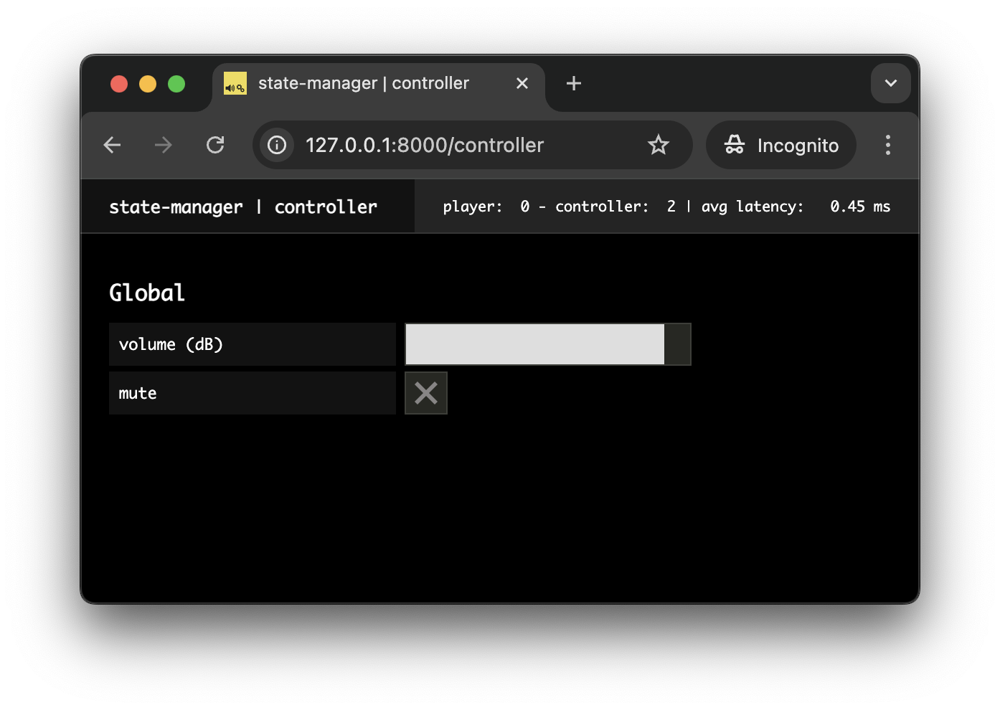
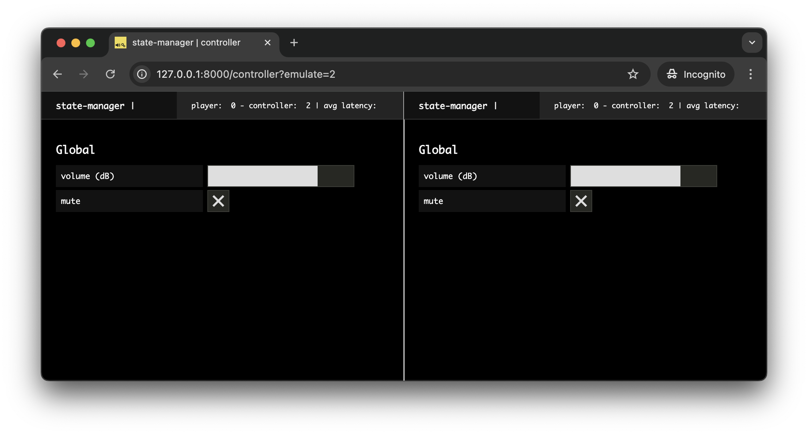
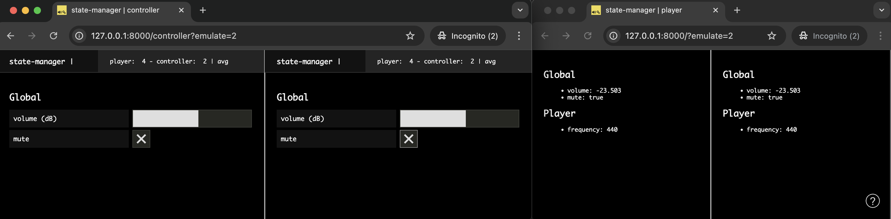
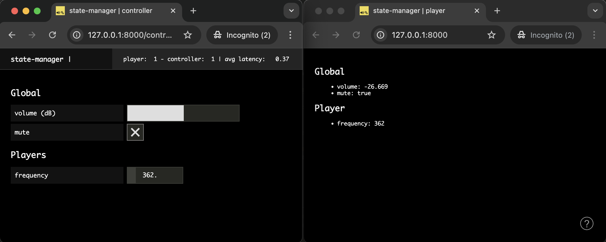
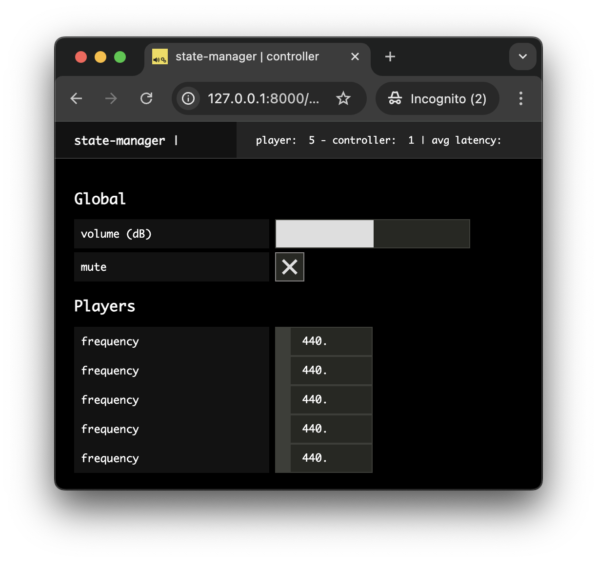
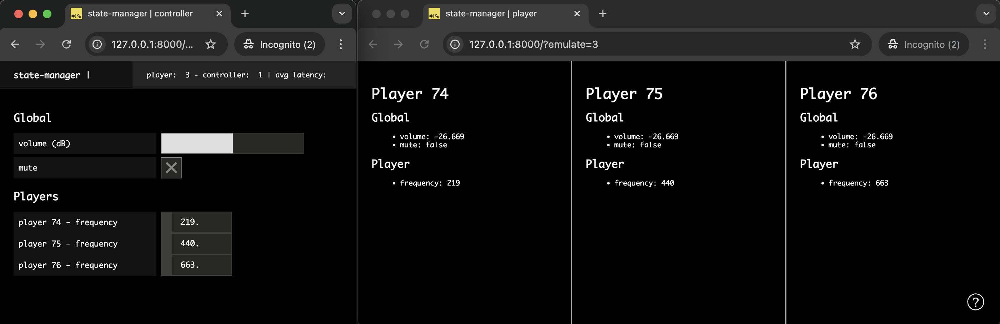

# Using the State Manager

In this tutorial, we will dig into the distributed state management system proposed by _soundworks_. After a short introduction on the underlying concepts, we will see how to use shared states, and how this pattern can help you to implement remote control and monitoring in your applications. Along the way, we will see how the shared states simplify the development of distributed applications by abstracting the network communications and messages routing.

Along the way, we will discover a related library, [@ircam/sc-components](https://ircam-ismm.github.io/sc-components/), to simply create usable (and hopefully elegant) graphical user interfaces.

### Relevant documentation

- [client.StateManager](https://soundworks.dev/soundworks/client.StateManager)
- [client.SharedState](https://soundworks.dev/soundworks/client.SharedState)
- [client.SharedStateCollection](https://soundworks.dev/soundworks/client.SharedStateCollection.html)
- [server.StateManager](https://soundworks.dev/soundworks/server.StateManager)
- [server.SharedState](https://soundworks.dev/soundworks/server.SharedState)
- [@ircam/sc-components](https://ircam-ismm.github.io/sc-components/)

## Introduction

First of all, let's start with a bit of theory to understand the concepts and general logic behind the _soundworks_' shared states. 

### The "Why"

Most of the time, we think of an application as "something" that runs on a computer with which a user can interact in some way. The idea of _distributed application_ extends this to applications that run on several computers and where several users can interact at the same time. Or to say it in a more formal way:

> _« A distributed system is a collection of autonomous computing elements that appears to its users as a single coherent system. »_ Maarten van Steen, and Andrew S. Tanenbaum. “A Brief Introduction to Distributed Systems.” Computing 98, no. 10, October 2016.


Additionally, in creative contexts, it's important to have very simple ways to monitor and/or control the state of distant clients. This is true both during the development of the artwork / application, e.g. to tweak some synthesizer on distant machines from a central point (even in the studio, modifying some parameters on several machines can get cumbersome quite quickly), as well as during a performance, e.g. to control the general volume, to switch between two sections of the artwork, etc.

The `StateManager` and the `SharedState` abstractions proposed by _soundworks_ provide a simple way to define and synchronize some sets of parameters that are of interest by multiple clients, while abstracting all the network communications involved.

### The "How"

From a more technical point of view, the distributed state management system proposed by _soundworks_ is a circular dataflow pattern (loosely inspired by the [_flux_](https://facebook.github.io/flux/docs/in-depth-overview) pattern proposed by _Facebook_) adapted to the particular needs of real-time distributed applications. 

To that end, the flow data is structured according to a circular path that is always synchronized with the server.


As illustrated in the figure above, when an input (e.g. some user gesture) triggers a change in the state of a client (arrow 1, red), the data is automatically synchronized with a server-side representation of the state through WebSockets (arrow 2), which when done triggers the change in the rendering, be it audio or visual (arrow 3). 

This simple pattern enables an important feature: any other node of the network can make a change on the same server-side representation of the state (arrow 1', blue), which will trigger 2 (red) and 3 (red) in a completely transparent way.

::: info
In these tutorials, when we speak of a **_node of the network_**, we consider both the clients and the server. 

Form the point of view of the distributed state management system, the server is indeed a _node_ just as any client. However, its central role gives it particular abilities and features.
:::

## Scaffolding the application

::: info
This section requires basic knowledge of the `soundworks` wizard, so please refer to the [getting started tutorial](/tutorials/getting-started) if you didn't check it yet.
:::

First thing first, let's generate a new empty application with the `@soundworks/create` wizard. 

```sh
cd /path/to/working/directory
npx @soundworks/create@latest state-manager
```

When the wizard will ask you for the configuration of the default client:
- Name it `player`
- Select the `browser` target
- Select the `default` template


Then open the new `state-manager` directory in your favorite editor and launch the application in development mode:

```sh
cd state-manager
npm run dev
```

## Declaring schemas

The `StateManager` component is configured with JavaScript objects that declare a set of attributes and their properties, which we call "_schemas_". You can think of a _schema_ as a kind of blueprint from which multiple `SharedState` instances can be created. 

::: tip
If you are familiar with databases, you can think of it has the schema of a database table. 

The syntax for declaring schemas is described [here](https://soundworks.dev/soundworks/server.StateManager#~schema).
:::

In this application we will declare two different schemas:

- A schema called `global` which we will use to store informations accessible by all nodes of the network. This shared state will be unique across the whole application, i.e. it will be created by the server and all `player` clients will "attach" to it.
- A schema called `player`, which we will use to describe the state of a single client of the application. All clients with the `player` role will create their own `SharedState` instance from this scheme.

Let's then create the file `src/server/schemas/global.js`, and push the following code into it:

```js
// src/server/schemas/global.js
export default {
  // volume volume in dB [-60, 6]
  volume: {
    type: 'float',
    min: -60,
    max: 6,
    default: 0,
  },
  // mute [true, false]
  mute: {
    type: 'boolean',
    default: false,
  },
};
```

From this code we can see that this schema, and the derived `SharedState`, will allow us to control the _volume_ of all clients as well as to _mute/unmute_ them.

Second, let's create the file `src/server/schemas/player.js` containing the following code:

```js
// src/server/schemas/player.js
export default {
  frequency: {
    type: 'float',
    min: 50,
    max: 1000,
    default: 440,
  },
};
```

This schema will allow us to create `SharedState`s on every client, which we will use to control the _frequency_ of an oscillator.

From these two definitions, we can already foresee the structure of the audio graph that could be created by each client:

> `[OscillatorNode] -> [GainNode (mute)] -> [GainNode (volume)] -> [destination]`

- The `OscillatorNode` will be controlled by the states created from the `player` schema, each client being able to have different oscillator _frequency_ values.
- At contrary, the `GainNode`s (_mute_ and _volume_) will be controlled globally for all clients by the common state created from `global` schema.

To keep things focused on the distributed state management system, we won't actually create the audio graph in this tutorial, but this could be an interesting exercise to do on your own!.

:::info
Note that the `src/server/schemas` directory included in the application template is empty and not mandatory, i.e. schema declarations could potentially live anywhere in your code. It is just proposed as a good practice to keep things organized.
:::

## Registering schemas

Let's first import the schemas declarations into the `src/server/index.js` file:

```js {5-6}
// src/server/index.js
import { loadConfig } from '../utils/load-config.js';
import '../utils/catch-unhandled-errors.js';

import globalSchema from './schemas/global.js';
import playerSchema from './schemas/player.js';
```

Once done, we can register them into the `stateManager` instance of the _soundworks_ `server`:

```js {6-8}
// src/server/index.js
const server = new Server(config);
// configure the server for usage within this application template
server.useDefaultApplicationTemplate();

// register the schemas
server.stateManager.registerSchema('global', globalSchema);
server.stateManager.registerSchema('player', playerSchema);
```

Note that the `stateManager.registerSchema` method takes 2 arguments:
- A _user defined_ name, here `'global'` and `'player'`.
- A schema definition, here `globalSchema` and `playerSchema`.

This signature allows to define simple user-friendly names for creating and attaching shared state, but also allows to register the same schema under different names in more advanced use cases.

Now that our schemas are registered into the `server.stateManager`, we can safely create new instances of `SharedState`s based on these schemas.

## Creating shared states

Let's first create our `global` shared state based on the schema declaration we defined in `src/server/schemas/global.js`. 

As explained above, we want this shared state to be unique across the entire application so that all clients share the same values. This can be simply achieved:
1. by _creating_ the state on the server-side, i.e. the server is thus the _owner_ of the state.
2. by _attaching_ all our clients to this state, i.e. they have full access to the shared state values but they do not own it, which means that the state won't be deleted when they disconnect.

While this distinction between `create` and `attach` can be a bit confusing at first this will get more clear writing the code. 

Let's thus add following lines into the `src/server/index.js` to create our `global` `SharedState` instance from the schema we just registered with the name `'global'`:

```js {4-5}
// src/server/index.js
await server.start();

const global = await server.stateManager.create('global');
console.log(global.getValues());
```

In your `Terminal` window, you should now see the default values of the state displayed:


Let 's now _attach_ all our `player` clients to the `global` state created by the server.

To that end, open the file `src/clients/player/index.js` and add the following lines of code:

```js {4-5}
// src/clients/player/index.js
await client.start();

const global = await client.stateManager.attach('global');
console.log(global.getValues());
```

Note that, instead of the method `stateManager.create` used on the server side, we use its conterpart `stateManager.attach` on the client side .

If you open the URL [http://127.0.0.0:8000](http://127.0.0.0:8000) in your browser of choice and open the JavaScript console, you should see the current values of the `global` state displayed in the console just as for the server:


::: tip
To open the _JavaScript_ console in your browser, you can press `Cmd + Alt + J` in 
_Chrome_ or alternatively `Cmd + Alt + I` in _Firefox_, then select the `Console` tab.
::: 

While we are on the client-side code of our "player" clients, let's create the `player` shared state for each of them. To that end, add the following line of code in the `src/clients/player/index.js` file:

```js {5}
// src/clients/player/index.js
await client.start();

const global = await client.stateManager.attach('global');
const player = await client.stateManager.create('player');
```

Here, you can see side-by-side the `stateManager.create` and `stateManager.attach` methods and how they relate: 
- `stateManager.create` creates a new instance of a shared state that is owned by the node (clients or server).
- `stateManager.attach` attach to an existing shared state instance created and owned by another node.

## Display the states values

Now that our shared states are setup, let's continue on our client-side code to display the current values of the different shared states and update the screen when their values change. 

::: info
In these series, all HTMl rendering will be achieved by using the [Lit](https://lit.dev/) library proposed by _Google_ and the [@ircam/sc-components](https://ircam-ismm.github.io/sc-components/) library. Both libraries are installed by default when you create a new application using the soundworks wizard.
:::

Let's first modify the `renderApp` provided by the "player" boilerplate code to display the values of our two states:

```js
// src/clients/player.js
await client.start();

const global = await client.stateManager.attach('global');
const player = await client.stateManager.create('player');

function renderApp() {
  render(html`
    <div class="simple-layout">
      <p>Hello ${client.config.app.name}!</p> // [!code --]
      <h2>Global</h2> // [!code ++]
      <ul> // [!code ++]
        <li>volume: ${global.get('volume')}</li> // [!code ++]
        <li>mute: ${global.get('mute')}</li> // [!code ++]
      </ul> // [!code ++]
      <h2>Player</h2> // [!code ++]
      <ul> // [!code ++]
        <li>frequency: ${player.get('frequency')}</li> // [!code ++]
      </ul> // [!code ++]

      <sw-credits .infos="${client.config.app}"></sw-credits>
    </div>
  `, $container);
}

renderApp();
```

If you refresh your web page (`Cmd + Shift + R`), you should now see the following:



So far so good, we have all our states set up and some display of their values. It's indeed only graphical and we won't go into the audio details in this tutorial to keep things focused on the shared states, but the general idea would be exactly the same with some audio rendering.

However, what we miss now is a way to change the values of the states. While we could implement it directly in our `player` clients, we will go a bit deeper with the `StateManager` and create a new client dedicated to this task.

## Remote control and monitoring

In this section we will implement a second type od client, we will call `controller`, dedicated to control and monitor the general state of the application. 

### Scaffolding the _controller_ client

Let's use the soundworks wizard to configure our new client and to create all the boilerplate code. 

Go to the `Terminal`, shutdown the server (`Ctrl + C`) and enter the following command:

```sh
npx soundworks --create-client
```

Just as when you created the application at the beginning of the tutorial, the soundworks wizard will ask you some questions to configure the client:
1. Name this new client `controller`
2. Select the `browser` target
3. But this time select the `controller` template

Additionnally, the wizard will ask you if you want to use this client as the default one (meaning it will be accessible at the root of your website), choose `no` and confirm.


In your editor you can see that new directory `src/clients/controller` has been created by the wizard. This is where we will implement the logic for our "controller" client. 

Now that eveything are set up, we can go back to the implementation of our `controller` client. Let's then first restart our development server:

```
npm run dev
```

and open the page [http://127.0.0.1:8000/controller](http://127.0.0.1:8000/controller) 

::: tip
Note that the `/controller` part of the URL is automatically created by soundworks according to the names of the clients.
:::

### Binding the `global` state

Let's start with creating the controls for the `global` shared state. Open the `src/clients/controller/index.js` file and add the following code to import some high-level components provided by the [@ircam/sc-components](https://ircam-ismm.github.io/sc-components/) library:

```js {7-10}
// src/clients/controller/index.js
import '@soundworks/helpers/polyfills.js';
import { Client } from '@soundworks/core/client.js';
import launcher from '@soundworks/helpers/launcher.js';

import { html, render } from 'lit';
import '@ircam/sc-components/sc-number.js';
import '@ircam/sc-components/sc-slider.js';
import '@ircam/sc-components/sc-text.js';
import '@ircam/sc-components/sc-toggle.js';

import '../components/sw-audit.js';
```

Importing these files will register new HTML elements that we can now use in our HTML templates: a text element to display parameter names, a slider to control the volume, a toggle button to control the mute parameter, and a number box to control the players' frequencies.

:::info
Such HTML components are called Web Components, see [https://developer.mozilla.org/en-US/docs/Web/Web_Components](https://developer.mozilla.org/en-US/docs/Web/Web_Components) for more information on this specific subject.
:::

Then, such as for the `player`, let's attach to the global state and create a component that displays its values:

```js
// src/clients/controller/index.js
await client.start();

const global = await client.stateManager.attach('global'); // [!code ++]

function renderApp() {
  render(html`
    <div class="controller-layout">
      <header>
        <h1>${client.config.app.name} | ${client.role}</h1>
        <sw-audit .client="${client}"></sw-audit>
      </header>
      <section>
        <p>Hello ${client.config.app.name}!</p> // [!code --]
        <div> // [!code ++]
          <h2>Global</h2> // [!code ++]
          <div style="padding-bottom: 4px;"> // [!code ++]
            <sc-text readonly value="volume (dB)"></sc-text> // [!code ++]
            <sc-slider // [!code ++]
              min="-60" // [!code ++]
              max="6" // [!code ++]
              value=${global.get('volume')} // [!code ++]
            ></sc-slider> // [!code ++]
          </div> // [!code ++]
          <div style="padding-bottom: 4px;"> // [!code ++]
            <sc-text readonly value="mute"></sc-text> // [!code ++]
            <sc-toggle // [!code ++]
              ?active=${global.get('mute')}" // [!code ++]
            ></sc-toggle> // [!code ++]
          </div> // [!code ++]
        </div> // [!code ++]
      </section>
    </div>
  `, $container);
}

renderApp();
```

If you refresh your `controller` page, you should now see the following interface with the `global` shared state default values correctly displayed (see usage of the [`global.get`](https://soundworks.dev/soundworks/client.SharedState.html#get) method):



However, the binding between the state and the interface is still missing: interacting the interface (e.g. moving the slider or clicking the toggle) does not yet update the shared state values. To fix that, we simply need to use the [`global.set`](https://soundworks.dev/soundworks/client.SharedState.html#set) method and add the following lines of code:

```js
// src/clients/controller/index.js
function renderApp() {
  render(html`
    <div class="controller-layout">
      <header>
        <h1>${client.config.app.name} | ${client.role}</h1>
        <sw-audit .client="${client}"></sw-audit>
      </header>
      <section>
        <div>
          <h2>Global</h2>
          <div style="padding-bottom: 4px;">
            <sc-text readonly value="volume (dB)"></sc-text>
            <sc-slider
              min="-60"
              max="6"
              value=${global.get('volume')}
              @input=${e => global.set({ volume: e.detail.value })} // [!code ++]
            ></sc-slider>
          </div>
          <div style="padding-bottom: 4px;">
            <sc-text readonly value="mute"></sc-text>
            <sc-toggle
              ?active=${global.get('mute')}
              @change=${e => global.set({ mute: e.detail.value })} // [!code ++]
            ></sc-toggle>
          </div>
        </div>
      </section>
    </div>
  `, $container);
}
```

Finally, we just need to tell your interface to re-render itself when the `global` is updated, which can be achieved by using the [`global.onUpdate`](https://soundworks.dev/soundworks/client.SharedState.html#onUpdate) method:

```js
const global = await client.stateManager.attach('global');

function renderApp() {
  // ...
}

// update interface when the shared state values are updated
global.onUpdate(() => renderApp()); // [!code ++]

renderApp();
```

Now, if you open [http://127.0.0.1:8000/controller?emulate=2](http://127.0.0.1:8000/controller?emulate=2) to emulate two `controller` clients side by side (see the `?emulate=2` at the end of the URL), you should see that both interfaces are fully synchronized through the `global` shared state.



Now that our "controller" is ready, let's go back to our `player` clients to implement the same logic to update of the screen when the shared states are updated. So let's re-open the `src/clients/player/index.js` file and add the following lines of code:

```js
// src/clients/player/index.js
await client.start();

const global = await client.stateManager.attach('global');
const player = await client.stateManager.create('player');

function renderApp() {
  // ...
}

global.onUpdate(() => renderApp()); // [!code ++]
player.onUpdate(() => renderApp()); // [!code ++]

renderApp();
```

With these two simple lines of code, all the clients are now automatically updated anytime a shared-state parameter is modified. To see this in action, open two browser windows side by side and open some controller(s) in one of them [http://127.0.0.1:8000/controller?emulate=2](http://127.0.0.1:8000/controller?emulate=2) and some players in the other one [http://127.0.0.1:8000/?emulate=2](http://127.0.0.1:8000/?emulate=2).



### Observing and controlling collections of states

The final thing we would like to do, would be to be able to control the frequency of each player from our `controller` clients. To that end, the controller needs to be able to track the creation (and deletion) of all `player` states in the distributed application. Fortunately, the `StateManager` gives you access to such functionality.

Let's thus create a new [`SharedStateCollection`](https://soundworks.dev/soundworks/client.SharedStateCollection.html) of players and make sure the interface is updated each time a "player" state is created (i.e. when a client connects to the application), is deleted (i.e. when a client disconnects from the application), or when a state is updated:

```js {4-24}
// src/clients/controller/index.js
await client.start();

const global = await client.stateManager.attach('global');
// Create a new collection that contains all the player states
const players = await client.stateManager.getCollection('player'); // [!code ++]

function renderApp() {
  // ...
}

// update interface when the shared state values are updated
global.onUpdate(() => renderApp());
players.onAttach(() => renderApp()); // when a state is created // [!code ++]
players.onDetach(() => renderApp()); // when a state is deleted // [!code ++]
players.onUpdate(() => renderApp()); // when a state is updated // [!code ++]
```

Finally, let's just update our HTML template to display the frequency control for all `player` shared states:

```js
render(html`
  <header>
    // ...
  </header>
  <section>
    <div>
      <h2>Global</h2>
      // ...
    </div>
    <div> // [!code ++]
      <h2>Players</h2> // [!code ++]
      ${players.map(player => { // [!code ++]
        return html` // [!code ++]
          <div> // [!code ++]
            <sc-text>frequency</sc-text> // [!code ++]
            <sc-number // [!code ++]
              min="50" // [!code ++]
              max="1000" // [!code ++]
              value=${player.get('frequency')} // [!code ++]
              @input=${e => player.set({ frequency: e.detail.value })} // [!code ++]
            ></sc-number> // [!code ++]
          </div> // [!code ++]
        ` // [!code ++]
      })} // [!code ++]
    </div> // [!code ++]
  </section>
`, $container);
```

Now if you open two browser windows and launch a controller [http://127.0.0.1:8000/controller](http://127.0.0.1:8000/controller) and a player [http://127.0.0.1:8000/](http://127.0.0.1:8000/), you will see that you can control the frequency of the player from the controller.



However, there is still an issue with our interface: if we emulate several player clients, e.g. [http://127.0.0.1:8000/?emulate=6](http://127.0.0.1:8000/?emulate=6), we can see that we have no way to know which control correspond to which player:



Let's review our code a bit to takle this issue.

### Using the client id to enhance the control interface

To fix this problem, let's just use the id that is automatically given by _soundworks_ to each client when it connects to share it within the `player` state.

So first, let's add a new parameter called `id` of type `inteeger` to our `player` schema to store this value:

```js {3-6}
// src/server/schemas/player.js
export default {
  id: { // [!code ++]
    type: 'integer', // [!code ++]
    default: 0, // [!code ++]
  }, // [!code ++]
  frequency: {
    type: 'float',
    min: 50,
    max: 1000,
    default: 440,
  },
};
```

Second, let's review our `player` client code to:

1. pass the client id to the shared state when it is created by the client

```js 
// src/clients/player/index.js
const global = await client.stateManager.attach('global');
// create the player state with the client id
const player = await client.stateManager.create('player') // [!code --]
const player = await client.stateManager.create('player', { id: client.id }); // [!code ++]
```

2. and display the `client.id` in the player interface:

```js
// src/clients/player/index.js
function renderApp() {
  render(html`
    <div class="simple-layout">
      <h1>Player ${player.get('id')}</h1> // [!code ++]
      <h2>Global</h2>
      // ...
    </div>
  `, $container);
}

```

Finally, let's just display this information in the controller interface:

```js
// src/clients/controller/index.js
${players.map(player => {
  return html`
    <div>
      <sc-text>frequency</sc-text> // [!code --]
      <sc-text>player: ${player.get('id')} - frequency</sc-text> // [!code ++]
      <sc-number
        min="50"
        max="1000"
        value=${player.get('frequency')}
        @input=${e => player.set({ frequency: e.detail.value })}
      ></sc-number>
    </div>
  `
})}
```

Now, if you open a controller ([http://127.0.0.1:8000/controller](http://127.0.0.1:8000/controller)) and several players ([http://127.0.0.1:8000/?emulate=3](http://127.0.0.1:8000/?emulate=3)) side by side, you should have a  more usefull interface:



## Conclusion

In this tutorial, you learned how to use the _soundworks_ distributed state management system which we think is one of its most powerfull and versatile feature.

You have seen how to create global states that are common to all clients of the application, how to use them to describe the state of each client and how use them to implement remote control and monitoring interfaces using state collections. Along the way, you have seen how to use the _soundworks_ wizard within your application (i.e. `npx soundworks`).

In the next tutorial, we will see how to extend the possibilities of _soundworks_ with plugins. For this first dive into plugins we will use the `@soundworks/plugin-platform-init` plugin that is meant to simplify some redondant and cumbersome tasks such as resuming the audio context, etc.


