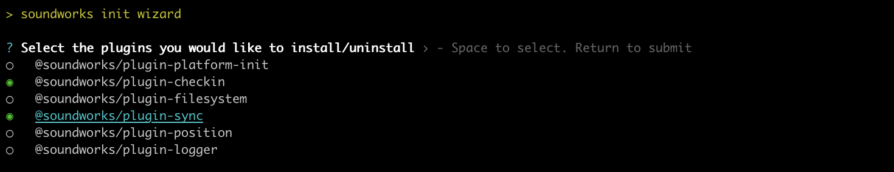
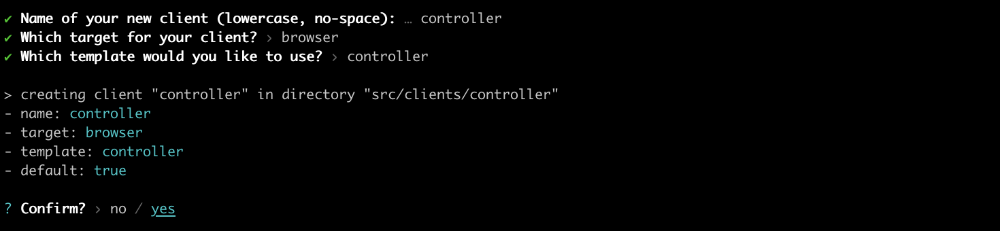
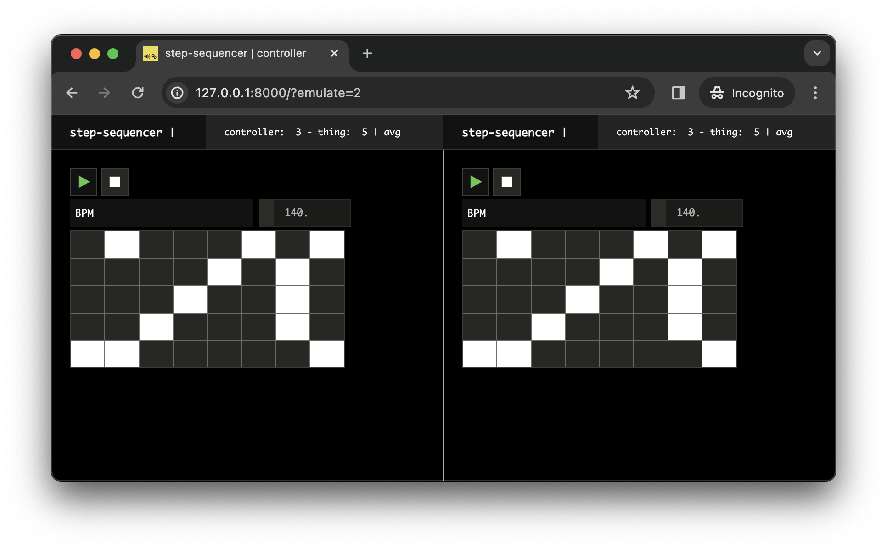

<script setup>
import { withBase } from 'vitepress'
</script>

# Building a Distributed Step Sequencer

In this tutorial, we will use the soundworks' _sync_ plugin we just learned to build a more advanced application: a distributed step sequencer. 

The step sequencer will be based on _Node.js_ clients, representing each a track of our step sequencer, i.e. one the kick, one for the snare, etc. and one browser controller client to rule them all:


Along the way we will use another plugin, the _checkin_ plugin, which allows us to assign a unique index to each clients.

### Related documentation

- [@soundworks/plugin-sync](https://github.com/collective-soundworks/soundworks-plugin-sync)
- [@soundworks/plugin-checkin](https://github.com/collective-soundworks/soundworks-plugin-checkin)
- [@ircam/sc-scheduling](https://github.com/ircam-ismm/sc-scheduling)
- [@ircam/sc-loader](https://github.com/ircam-ismm/sc-loader)

## Scaffolding application

Let's start with scaffolding our application using the soundworks wizard:

```sh
cd path/to/tutorials
npx @soundworks/create@latest step-sequencer
```

When the wizard ask to select the plugin, let's then select `@soundworks/plugin-sync` and the `@soundworks/plugin-checkin` plugins:



And let's define our default client as a controller:



Once done, let's go into our `step-sequencer` directory and install a few more dependencies we will need using `npm`:

```sh
cd step-sequencer
npm install --save @ircam/sc-scheduling @ircam/sc-loader node-web-audio-api
```

Finally, let's just create our node client, we will name `thing`:

```sh
npx soundworks --create-client
```


We can now start our server:

```js
npm run dev
```

And, in different "Terminal", emulate 5 thing clients:

```sh
cd path/to/tutorials/step-sequencer
EMULATE=5 npm run watch thing
```

::: tip
To easily get the current directory in "Terminal" you can use the `pwd` command
:::

## Defining the global state

Now that everything is set up, let's continue with defining the different parameters that describe our application and declare them in a global state.

Indeed, we will need several parameters to control our step sequencer:
- A variable which will define if our step sequencer is running or not ("start / stop").
- A timestamp (in synchronized time) associated to the start / stop event to make sure all our clients start at the same exact time.
- A BPM value for our step sequencer.
- A score.

To keep things simple, we won't allow to change the BPM while the step sequencer is running. Indeed, having such functionality would imply to also synchronize our BPM change among every clients, which would lead to over complicate this tutorial.

Let's thus create a file named `global.js` in the `src/server/schemas` directory and translate these information into a schema definition:

```js
// src/server/schemas/global.js
export default {
  running: {
    type: 'boolean',
    default: false,
  },
  startTime: {
    type: 'float',
    default: null,
    nullable: true,
  },
  BPM: {
    type: 'integer',
    default: 120,
  },
  score: {
    type: 'any',
    default: [],
  },
};
```

Let's then register this schema in our server:

```js
// src/server/index.js
import { loadConfig } from '../utils/load-config.js';
import '../utils/catch-unhandled-errors.js';

import globalSchema from './schemas/global.js'; // [!code ++]

// ...

const server = new Server(config);
server.useDefaultApplicationTemplate();

server.stateManager.registerSchema('global', globalSchema); // [!code ++]
```

And define some default values for our tracks. Note that we will consider that our step sequencer has 5 different tracks with 8 steps each, and that we will create a branch to initialize our score in debug mode (with some values filled) according to a `debug` flag to ease the development:

```js
await server.start();
// change this flag to false to empty score by default // [!code ++]
const debug = true; // [!code ++]
let score; // [!code ++]
 // [!code ++]
if (debug) { // [!code ++]
  // if debug, fill score with default values // [!code ++]
  score = [ // [!code ++]
    [0, 1, 0, 1, 0, 1, 0, 1], // [!code ++]
    [0, 0, 0, 0, 0, 0, 0, 0], // [!code ++]
    [0, 0, 0, 0, 0, 0, 1, 0], // [!code ++]
    [0, 0, 1, 0, 0, 0, 1, 0], // [!code ++]
    [1, 0, 0, 0, 1, 0, 0, 1], // [!code ++]
  ]; // [!code ++]
} else { // [!code ++]
  // if not debug, empty score // [!code ++]
  score = [ // [!code ++]
    [0, 0, 0, 0, 0, 0, 0, 0], // [!code ++]
    [0, 0, 0, 0, 0, 0, 0, 0], // [!code ++]
    [0, 0, 0, 0, 0, 0, 0, 0], // [!code ++]
    [0, 0, 0, 0, 0, 0, 0, 0], // [!code ++]
    [0, 0, 0, 0, 0, 0, 0, 0], // [!code ++]
  ]; // [!code ++]
} // [!code ++]
 // [!code ++]
const global = await server.stateManager.create('global', { // [!code ++]
  score, // [!code ++]
}); // [!code ++]
```

## Registering the plugins

Now that our state is set up, let's install and configure our different plugins.

First let's register the plugins in the server side:

```js
import '@soundworks/helpers/polyfills.js';
import { Server } from '@soundworks/core/server.js';
import pluginSync from '@soundworks/plugin-sync/server.js'; // [!code ++]
import pluginCheckin from '@soundworks/plugin-checkin/server.js'; // [!code ++]

import { loadConfig } from '../utils/load-config.js';

// ...

const server = new Server(config);
server.useDefaultApplicationTemplate();

server.pluginManager.register('sync', pluginSync); // [!code ++]
server.pluginManager.register('checkin', pluginCheckin); // [!code ++]

server.stateManager.registerSchema('global', globalSchema);
```

And in our two "controller" and "thing" clients. Note that as we will use the checkin to get a unique index which will allow us to get a track from the score to be played, we will only register the _checkin_ plugin on the "thing" client.

Let's start with the "controller":

```js
// src/clients/controller/index.js
import launcher from '@soundworks/helpers/launcher.js';
import pluginSync from '@soundworks/plugin-sync/client.js'; // [!code ++]

import { html, render } from 'lit';

// ...

client.pluginManager.register('sync', pluginSync); // [!code ++]

await client.start();
``` 

Then let's install our two plugins in our "thing" clients, as you may recall in the last tutorial, in this case we will want to synchronize the audio clock, which will thus require a bit more configuration:

```js
// src/clients/thing/index.js
import { Client } from '@soundworks/core/client.js';
import launcher from '@soundworks/helpers/launcher.js';
import pluginSync from '@soundworks/plugin-sync/client.js'; // [!code ++]
import pluginCheckin from '@soundworks/plugin-checkin/client.js'; // [!code ++]
import { AudioContext } from 'node-web-audio-api'; // [!code ++]

import { loadConfig } from '../../utils/load-config.js';

// ...

const client = new Client(config);
const audioContext = new AudioContext(); // [!code ++]
 // [!code ++]
client.pluginManager.register('checkin', pluginCheckin); // [!code ++]
client.pluginManager.register('sync', pluginSync, { // [!code ++]
  getTimeFunction: () => audioContext.currentTime, // [!code ++]
}); // [!code ++]
```

## Implementing the controller

Now that everything is set up, it is time to implement our controller logic. 

Let's first import a few components, attach to our `global` state and sketch our graphical user interface:

```js
// src/clients/controller/index.js
import { html, render } from 'lit';
import '../components/sw-audit.js';

import '@ircam/sc-components/sc-matrix.js'; // [!code ++]
import '@ircam/sc-components/sc-text.js'; // [!code ++]
import '@ircam/sc-components/sc-transport.js'; // [!code ++]
import '@ircam/sc-components/sc-number.js'; // [!code ++]

// ... 

await client.start();

const global = await client.stateManager.attach('global'); // [!code ++]
// update screen on update // [!code ++]
global.onUpdate(() => renderApp()); // [!code ++]

function renderApp() {
  render(html`
    <div class="controller-layout">
      <header>
        <h1>${client.config.app.name} | ${client.role}</h1>
        <sw-audit .client="${client}"></sw-audit>
      </header>
      <section>
        <p>Hello ${client.config.app.name}!</p> // [!code --]
        <div> // [!code ++]
          <div style="margin-bottom: 4px;"> // [!code ++]
            <sc-transport  // [!code ++]
              .buttons=${['play', 'stop']} // [!code ++]
              value=${global.get('running') ? 'play' : 'stop'} // [!code ++]
            ></sc-transport> // [!code ++]
          </div> // [!code ++]
          <div style="margin-bottom: 4px;"> // [!code ++]
            <sc-text>BPM</sc-text> // [!code ++]
            <sc-number // [!code ++]
              min="50" // [!code ++]
              max="240" // [!code ++]
              value=${global.get('BPM')} // [!code ++]
            ></sc-number> // [!code ++]
          </div> // [!code ++]
          <div style="margin-bottom: 4px;"> // [!code ++]
            <sc-matrix // [!code ++]
              .value=${global.get('score')} // [!code ++]
            ></sc-matrix> // [!code ++]
          </div> // [!code ++]
        </div>
      </section>
    </div>
  `, $container);
}
```

If you open your controller in a Web browser, you should now see the following interface:


Now let's just change a bit our code to propagate the changes made in our interface in the `global` state:

```js
await client.start();

  const global = await client.stateManager.attach('global');
  // update screen on update
  global.onUpdate(() => renderApp());

  const sync = await client.pluginManager.get('sync'); // [!code ++]

  function renderApp() {
    render(html`
      <div class="controller-layout">
        <header>
          <h1>${client.config.app.name} | ${client.role}</h1>
          <sw-audit .client="${client}"></sw-audit>
        </header>
        <section>
          <div>
            <div style="margin-bottom: 4px;">
              <sc-transport
                .buttons=${['play', 'stop']}
                value=${global.get('running') ? 'play' : 'stop'}
                @change=${e => { // [!code ++]
                  if (e.detail.value === 'stop') { // [!code ++]
                    global.set({ running: false }); // [!code ++]
                  } else { // [!code ++]
                    // grab current sync time // [!code ++]
                    const syncTime = sync.getSyncTime(); // [!code ++]
                    // add an offset to the syncTime to handle network latency // [!code ++]
                    const startTime = syncTime + 0.5; // [!code ++]
                    // propagate values on the network // [!code ++]
                    global.set({ running: true, startTime }); // [!code ++]
                  } // [!code ++]
                }} // [!code ++]
              ></sc-transport>
            </div>
            <div style="margin-bottom: 4px;">
              <sc-text>BPM</sc-text>
              <sc-number
                min="50"
                max="240"
                value=${global.get('BPM')}
                ?disabled=${global.get('running')} // [!code ++]
                @change=${e => global.set({ BPM: e.detail.value })} // [!code ++]
              ></sc-number>
            </div>
            <div style="margin-bottom: 4px;">
              <sc-matrix
                .value=${global.get('score')}
                @change=${e => global.set({ score: e.detail.value })} // [!code ++]
              ></sc-matrix>
            </div>
          </div>
        </section>
      </div>
    `, $container);
  }
```

::: info
Note how we disabled the BPM number box when the step sequencer is running:
```js
?disabled=${global.get('running')}
``` 
to make clear to the user that the BPM can be changed only when it is stopped.
:::

If you now open two controllers side by side, e.g. [http://127.0.0.1:8000?emulate=2](http://127.0.0.1:8000?emulate=2), you should see that the two controllers stay perfectly synchronized:



## Implementing the audio engine

Now that all our controls are set up, let's go back to our thing clients to implement the audio engine and logic.

### Loading some audio files

First let's add a few audio files into our project, that our step sequencer will be able to use for audio rendering. For simplicity, let's put them in the `public` directory.

::: info
The set of samples used in the tutorial can be downloaded <a :href="(withBase('/static-assets/step-sequencer-samples.zip'))">here</a>
:::

Your file system should now look like the following:


Now let's load these file into our thing clients:

```js
import { AudioContext } from 'node-web-audio-api';
import { AudioBufferLoader } from '@ircam/sc-loader'; // [!code ++]
import { loadConfig } from '../../utils/load-config.js';

// ...

await client.start();

const audioFiles = [ // [!code ++]
  'public/assets/hh.wav', // [!code ++]
  'public/assets/clap.wav', // [!code ++]
  'public/assets/rimshot.wav', // [!code ++]
  'public/assets/snare.wav', // [!code ++]
  'public/assets/kick.wav', // [!code ++]
]; // [!code ++]
 // [!code ++]
const loader = new AudioBufferLoader(audioContext); // [!code ++]
const audioBuffers = await loader.load(audioFiles); // [!code ++]
 // [!code ++]
console.log(audioBuffers); // [!code ++]
```

You should see logged into the console the loaded audio buffers.

### Creating the synchronized scheduler

Then, let's create a scheduler, running in the synchronized time, i.e. scheduling events in the synchronized timeline, but able to provide us the corresponding time in the `audioContext` time reference:

```js
import { AudioBufferLoader } from '@ircam/sc-loader';
import { Scheduler } from '@ircam/sc-scheduling'; // [!code ++]
import { loadConfig } from '../../utils/load-config.js';

// ...

await client.start();

// retrieve initialized sync plugin // [!code ++]
const sync = await client.pluginManager.get('sync'); // [!code ++]
const scheduler = new Scheduler(() => sync.getSyncTime(), { // [!code ++]
  // provide the transfert function that will allow the scheduler to map from // [!code ++]
  // its current time (the sync time) and the audio time (the sync plugin local time) // [!code ++]
  currentTimeToProcessorTimeFunction: syncTime => sync.getLocalTime(syncTime), // [!code ++]
}); // [!code ++]

const audioFiles = [
  // ...
];
```

### Implementing the audio engine

Then implement a simple audio engine that will play a track from the score and an associated buffer according to a given index:

### Binding all components with the shared state

Finally, let's attach to the `global` state and create our step sequencer engine which will react to updates of the `global` state:


## Conclusion
