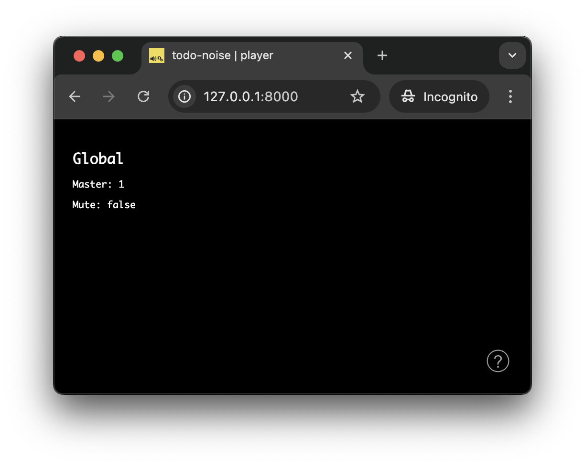
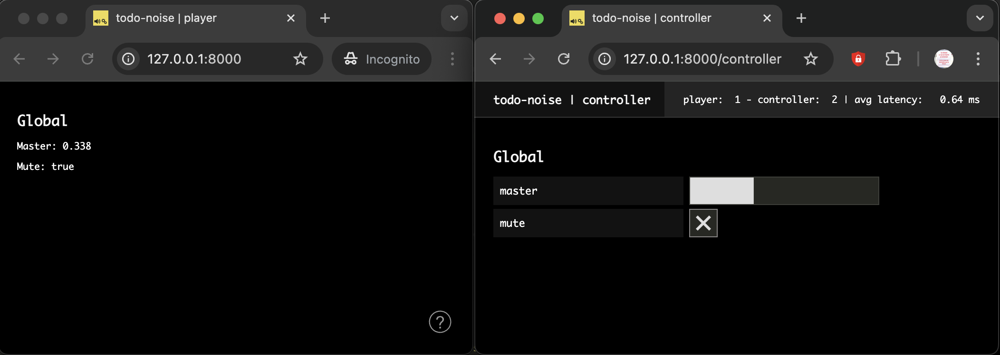
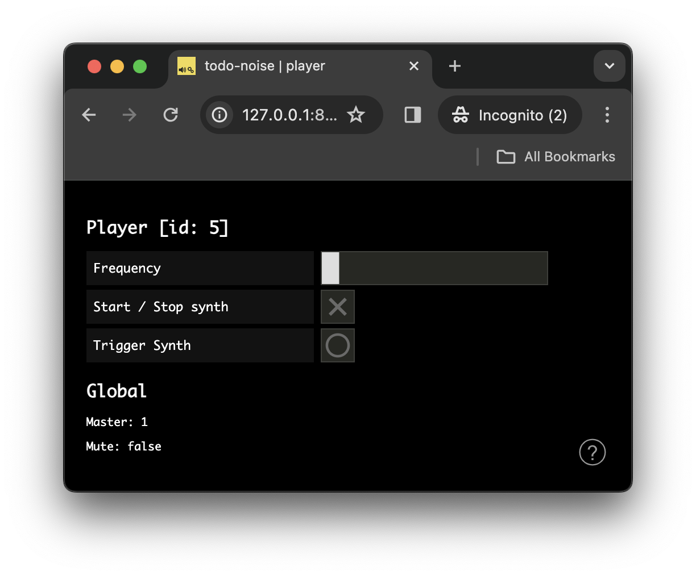

# The _Todo Noise_ Application

In this tutorial we will build a simple distributed audio application, which illustrates the most common type of distributed interaction you will need to implement in your own applications: i.e. remote monitoring and control.

The tutorial requires basic knowledge of the _soundworks_ [state manager](./state-manager.html) and of the [platform-init plugin](./plugin-platform-init.html), so please refer to the relevant tutorials if you didn't check them yet.

Along the way, we will discover how to create our own reusable [Web Components](https://developer.mozilla.org/en-US/docs/Web/API/Web_components) using the [Lit](https://lit.dev/) library proposed by default in soundworks applications.

### Relevant documentation

- [SharedState](https://soundworks.dev/soundworks/SharedState.html)
- [SharedStateCollection](https://soundworks.dev/soundworks/SharedStateCollection.html)
- [@soundworks/plugin-platform-init](/plugins/platform-init.html)
- [Web Components](https://developer.mozilla.org/en-US/docs/Web/API/Web_components)
- [Lit](https://lit.dev/)

## User Story

The application purposely privileges the point of view of a user in a working situation (e.g. developer, designer, composer or performer) rather than the point of view of the end user (e.g. participant, audience). Indeed, while the later is most of the time very specific to the application or artwork, the former generally requires some properties and features that are relatively common. To illustrate these two roles, the application is composed of two different types of clients: the _player_ and the _controller_.

The _player_ can be envisioned as the client dedicated to the end users. The application can accept any number of players and each player has access to the following functionalities:
- It can trigger a sound.
- It can start and stop a synthesizer.
- It can update a parameter (i.e. the frequency of the synths).

The _controller_ is dedicated to the user in working situation, be it during the creation or the performance of the artwork. The application can accept any number of controllers and each of them has access to the following functionalities:
- It controls global parameters of the application (i.e. mute, master volume). These global parameters must be synchronized among all the clients of the application (i.e. _player_ and _controller_).
- It can take full control over any _player_, i.e. the change the volume, trigger a sound and change the state of the synthesizer as if it was the client itself.

This minimal set of functionalities should provide a good overview of several important and recurring patterns at stake in real-time distributed audio applications.

## Scaffolding the application

First thing first, let's generate a new empty application with the `@soundworks/create` wizard:

```sh
cd /path/to/working/directory
npx @soundworks/create@latest todo-noise
```

You can already select the [`@soundworks/plugin-platform-init`](https://github.com/collective-soundworks/soundworks-plugin-platform-init) plugin to have it installed.


Then, when the wizard asks you for the name of the default client, just call it `player`, and select the `browser` target as well as the `default` template:


Once the wizard ended, let's launch the `soundworks` development tools inside our application and select the "create a new soundworks client" option to create our second type of client, the _controller_:

```sh
cd todo-noise
npx soundworks
```


The devtool wizard will ask you for the same questions as when you just created the _player_ client. This time call the client `controller`, select the `browser` target and the `controller` template. Select `no`, the default value, when the tool asks if the client should be used as default:


:::tip
Selecting a client as _default_ means the client will be accessible at the root of the domain, which is for example more simple if you need to share an URL with the public. In the other case the name of the client will be used as the route to access it.

For example, in our application:
- the _player_ client would be accessible at `http://my-domain.com`
- the _controller_ client would be accessible at `http://my-domain.com/controller`
:::

Once done, you can exit the command-line devtool by typing `Ctrl+C` or by selecting the `→ exit` entry option.

Now that our project is scaffolded, let's create the schemas describing the states for each _player_ as well as the global state.

## Creating and using the shared `global` state

To implement the user story defined above, the application will rely on 2 types of schema:
- A schema defining global variables of the application (e.g. mute, master volume) which will be unique and shared by every connected clients.
- A schema that is tied to each connected player, i.e. each _player_ client will create its own shared state instance from this schema.

Let's start by defining and creating the global schema. Create a new file named `global.js` in the `src/server/schemas/` directory, and fill it with the following code:

```js
// src/server/schemas/global.js
export default { // [!code ++]
  master: { // [!code ++]
    type: 'float', // [!code ++]
    default: 1, // [!code ++]
    min: 0, // [!code ++]
    max: 1, // [!code ++]
  }, // [!code ++]
  mute: { // [!code ++]
    type: 'boolean', // [!code ++]
    default: false, // [!code ++]
  }, // [!code ++]
}; // [!code ++]
```

The global state derived from this schema will keep track of the master volume applied to all connected _player_ clients (i.e. a gain between 0 and 1), and whether they are muted or not.

Once done, let's instantiate the shared `global` state on the server and attach all clients (i.e. _players_ and _controllers_ to it).

### Create the shared instance

First let's create the shared instance on the server:

1. Import the schema in `src/server/index.js`:

```js
// src/server/index.js
import { loadConfig } from '../utils/load-config.js';
import '../utils/catch-unhandled-errors.js';

import globalSchema from './schemas/global.js'; // [!code ++]
```

2. Register the schema into the state manager and create the `global` state instance:

```js {4-5,8-10}
// src/server/index.js
const server = new Server(config);
server.useDefaultApplicationTemplate();
// register the global schema // [!code ++]
server.stateManager.registerSchema('global', globalSchema); // [!code ++]

await server.start();
// create the shared global state instance // [!code ++]
const global = await server.stateManager.create('global'); // [!code ++]
console.log(global.getValues()); // [!code ++]
```

Let's now start our server using `npm run dev`, you should see the current default values of the state logged in the terminal:


### Attaching the `global` state to the _player_ clients

Let's now attach all our _player_ clients to the global shared state. For now, we will only display its current values on the screen and will keep the actual audio code for later.

To attach to the `global` state, write the following snippet in the `src/clients/player/index.js` file:

```js
// src/clients/player/index.js
await client.start();
// attach to the global state // [!code ++]
const global = await client.stateManager.attach('global'); // [!code ++]
```

Then, modify the `renderApp` function provided by the template to log the current values of the global shared state:

```js {5-16}
// src/client/player/index
const global = await client.stateManager.attach('global');
const $layout = createLayout(client, $container);

function renderApp() {
  render(html`
    <div class="simple-layout">
      <p>Hello ${client.config.app.name}!</p> // [!code --]
      <h2>Global</h2> // [!code ++]
      <p>Master: ${global.get('master')}</p> // [!code ++]
      <p>Mute: ${global.get('mute')}</p> // [!code ++]

      <sw-credits .infos="${client.config.app}"></sw-credits>
    </div>
  `, $container);
}
```

Finally, register a callback function to the [`onUpdate`](https://soundworks.dev/soundworks/client.SharedState.html#onUpdate) method of the global state, to refresh our screen each time the state is updated:

```js
function renderApp() {
  // ...
}

global.onUpdate(() => renderApp(), true); // [!code ++]
renderApp(); // [!code --]
```

Note that the `true` passed as second parameter of the `onUpdate` method means that the given callback will be executed immediately at registration. This allows us to remove the last `renderApp()` line as we know the `renderApp` function will be executed at startup of the application.

If you open a player client at [`http://127.0.0.1:8000`](http://127.0.0.1:8000) you should now see the following:



### Controlling the `global` shared states from the _controller_ clients

Now that everything is setup on the _player_ side, let's implement our _controller_ client to be able to control the `global` state on all connected clients.

Similarly to what we did with the _player_ clients, let's open the `src/clients/controller/index.js` and:
- attach to the `global` state the same way we did for _players_,
- make sure the application screen is refreshed when the `global` state is updated

```js
// src/client/controller/index.js
await client.start();

const global = await client.stateManager.attach('global'); // [!code ++]

function renderApp() {
  // ...
}

global.onUpdate(() => renderApp(), true); // [!code ++]
renderApp(); // [!code --]
```

To create the interface, we will again use some components provided by the [@ircam/sc-compoents](https://ircam-ismm.github.io/sc-components/) library, which is installed by default by the _soundworks_ wizard. Let's then first import the components we need (i.e. text, slider and toggle) into our controller's `index.js` file:

```js
// src/client/controller/index.js
import { html, render } from 'lit';
import '../components/sw-audit.js';

import '@ircam/sc-components/sc-text.js'; // [!code ++]
import '@ircam/sc-components/sc-slider.js'; // [!code ++]
import '@ircam/sc-components/sc-toggle.js'; // [!code ++]
```

Finally, let's modify the `renderApp` function by adding the control component to the layout to control the `global` shared state:

```js
// src/client/controller/index.js
const global = await client.stateManager.attach('global');

function renderApp() {
  render(html`
    <div class="controller-layout">
      <header>
        <h1>${client.config.app.name} | ${client.role}</h1>
        <sw-audit .client="${client}"></sw-audit>
      </header>
      <section>
        <p>Hello ${client.config.app.name}!</p> // [!code --]
        <h2>Global</h2> // [!code ++]
        <div style="padding-bottom: 4px"> // [!code ++]
          <sc-text>master</sc-text> // [!code ++]
          <sc-slider // [!code ++]
            min=${global.getSchema('master').min} // [!code ++]
            max=${global.getSchema('master').max} // [!code ++]
            value=${global.get('master')} // [!code ++]
            @input=${e => global.set({ master: e.detail.value })} // [!code ++]
          ></sc-slider> // [!code ++]
        </div> // [!code ++]
        <div style="padding-bottom: 4px"> // [!code ++]
          <sc-text>mute</sc-text> // [!code ++]
          <sc-toggle // [!code ++]
            ?active=${global.get('mute')} // [!code ++]
            @change=${e => global.set({ mute: e.detail.value })} // [!code ++]
          ></sc-toggle> // [!code ++]
        </div> // [!code ++]
      </section>
    </div>
  `, $container);
}

global.onUpdate(() => renderApp(), true);
```

Now, if you open a `player` ([`http://127.0.0.1:8000`](http://127.0.0.1:8000)) and a `controller` ([`http://127.0.0.1:8000/controller`](http://127.0.0.1:8000/controller)) in two different windows side by side, you should be able to remote control the _player_ from the _controller_:



## Creating and using the `player` shared states

As defined in our user story, we want the _player_ clients to have some controls on their own interface. But importantly we also want to be able to take control over any _player_ remotely to simplify and fasten our development and creation process.

Indeed, once you start working with multiple physical devices (smartphones, tablets, etc.), being able to control each of them from a single central point can save you a lot of testing time. Time that will be better used to make your artwork and experience more interesting.

### Registering the schema and creating the states

To that end, we will define and register another schema, from which we will create a new state state for each connected _players_. Let's then create a new `src/server/schemas/player.js` file with the following snippet:

```js
// src/server/schemas/player.js
export default { // [!code ++]
  id: { // [!code ++]
    type: 'integer', // [!code ++]
    default: null, // [!code ++]
    nullable: true, // [!code ++]
  }, // [!code ++]
  frequency: { // [!code ++]
    type: 'float', // [!code ++]
    default: 200, // [!code ++]
    min: 50, // [!code ++]
    max: 2000, // [!code ++]
  }, // [!code ++]
  synthToggle: { // [!code ++]
    type: 'boolean', // [!code ++]
    default: false, // [!code ++]
    immediate: true, // [!code ++]
  }, // [!code ++]
  synthTrigger: { // [!code ++]
    type: 'boolean', // [!code ++]
    event: true, // [!code ++]
    immediate: true, // [!code ++]
  }, // [!code ++]
}; // [!code ++]
```

Then, just as with the `global` schema, import it and register the schema in the server's stateManager:

```js
// src/server/index.js
import globalSchema from './schemas/global.js';
import playerSchema from './schemas/player.js'; // [!code ++]

// ...

server.stateManager.registerSchema('global', globalSchema);
server.stateManager.registerSchema('player', playerSchema); // [!code ++]
```

The parameters of the `player` shared states will allow us to implement two different types of synthesizer with very common behavior: one that is triggered by an event (e.g. playing back a simple sound file, see `synthTrigger`) and a second one that can be started and stopped (e.g. playing a sound file in a loop, see `synthToggle`). To keep the audio code simple and focus on the architecture and the logic of the application, we will create very simple synthesizers based on oscillators and use the same `frequency` value for the two synths.

:::tip
Note the `immediate` attribute for the `synthToggle` and `synthTrigger` which is one of the different options that can be applied to tweak the shared states behavior. In this case `immediate` means that the value is propagated locally before being propagated on the network to keep the latency and responsiveness of the interface to the minimum. See the different [schema type definitions](https://soundworks.dev/soundworks/server.StateManager.html#~schema) for more information on the different options.
:::

So let's first create a new `player` state on each `player` client. To that end, add the following snippet in `src/clients/player/index.js`:

```js {5-7}
// src/clients/player/index.js
await client.start();

const global = await client.stateManager.attach('global');
const player = await client.stateManager.create('player', { // [!code ++]
  id: client.id, // [!code ++]
}); // [!code ++]
```

The second argument passed to the `stateManager.create` method allows to define initialization values of the state. Here, we simply pass the `client.id` generated by `soundworks` to the state so we can easily track which `player` shared state is bound to which client.

### Creating the graphical user interface

Then, let's create the `player` shared state control interface. To that end, we will create a simple Web Component using the `Lit` library. Creating this abstraction will allow us to simply reuse the component later in the _controller_ interface to remotely take control over any connected _player_.

Let's then create a new file called `sw-player.js` in the `src/clients/components` directory, with the following code:

```js
// src/clients/components/sw-player.js
import { LitElement, html, css } from 'lit';

// import needed GUI components
import '@ircam/sc-components/sc-text.js';
import '@ircam/sc-components/sc-slider.js';
import '@ircam/sc-components/sc-toggle.js';
import '@ircam/sc-components/sc-bang.js';

class SwPlayer extends LitElement {
  constructor() {
    super();
    // reference to the `player` state
    this.player = null;
    // stores the `unsubscribe` callback returned by the `state.onUpdate` methos
    // https://soundworks.dev/soundworks/client.SharedState.html#onUpdate
    this.unobserve = null;
  }

  connectedCallback() {
    super.connectedCallback();
    // update the component when a state change occurs
    this.unobserve = this.player.onUpdate(() => this.requestUpdate());
  }

  disconnectedCallback() {
    super.disconnectedCallback();
    // stop reacting to state change when the element is removed from the DOM
    this.unobserve();
  }

  render() {
    // create controls for the player state
    return html`
      <h2>Player [id: ${this.player.get('id')}]</h2>
      <div style="padding-bottom: 4px;">
        <sc-text>Frequency</sc-text>
        <sc-slider
          width="400"
          min=${this.player.getSchema('frequency').min}
          max=${this.player.getSchema('frequency').max}
          value=${this.player.get('frequency')}
          @input=${e => this.player.set({ frequency: e.detail.value })}
        ></sc-slider>
      </div>
      <div style="padding-bottom: 4px;">
        <sc-text>Start / Stop synth</sc-text>
        <sc-toggle
          ?active=${this.player.get('synthToggle')}
          @change=${e => this.player.set({ synthToggle: e.detail.value })}
        ></sc-toggle>
      </div>
      <div style="padding-bottom: 4px;">
        <sc-text>Trigger Synth</sc-text>
        <sc-bang
          ?active=${this.player.get('synthTrigger')}
          @input=${e => this.player.set({ synthTrigger: e.detail.value })}
        ></sc-bang>
      </div>
    `;
  }
}

// register the component into the custom elements registry
customElements.define('sw-player', SwPlayer);
```

Once done, we only need to import our new component and insert it into our application template:

```js
// src/clients/player/index.js
import { html, render } from 'lit';
import '../components/sw-credits.js';
import '../components/sw-player.js'; // [!code ++]

// ...

function renderApp() {
  render(html`
    <div class="simple-layout">
      <sw-player .player=${player}></sw-player> // [!code ++]

      <h2>Global</h2>
      <p>Master: ${global.get('master')}</p>
      <p>Mute: ${global.get('mute')}</p>

      <sw-credits .infos="${client.config.app}"></sw-credits>
    </div>
  `, $container);
}
```

After refreshing the page, your player should now look like the following:



## Creating the synthesizers

Everything is now ready to react to both the `player` and `global` states changes to play some sounds on our _player_ clients.

### Resume the context with the `platform-init` plugin

First thing first, let's instantiate a new `AudioContext`:

```js
// src/clients/player/index.js
const config = window.SOUNDWORKS_CONFIG;
// If multiple clients are emulated you might to want to share the audio context // [!code ++]
const audioContext = new AudioContext(); // [!code ++]

async function main($container) {
  // ...
}
```

::: tip
You can see that the `AudioContext` is created outside our `main` function, this allows to share the same context when we emulate several clients on the same page.
:::

As seen in the [platform-init plugin](./plugin-platform-init.html) tutorial, the audio context needs a user gesture to be resumed and be allowed to produce sound by the browser, so let's just import and configure it properly (remember that we have already asked the wizard to install it at the beginning of the tutorial).

Let's start with the server side:

```js
// src/server/index.js
import pluginPlatformInit from '@soundworks/plugin-platform-init/server.js'; // [!code ++]

import globalSchema from './schemas/global.js';
import playerSchema from './schemas/player.js';

// ...

const server = new Server(config);
server.useDefaultApplicationTemplate();

server.pluginManager.register('platform-init', pluginPlatformInit); // [!code ++]
```

And do the same on the client side:

```js
// src/clients/player/index.js
import { Client } from '@soundworks/core/client.js';
import launcher from '@soundworks/helpers/launcher.js';

import pluginPlatformInit from '@soundworks/plugin-platform-init/client.js'; // [!code ++]

// ...

const client = new Client(config);
// register the platform-init plugin, and pass it the AudioContext instance // [!code ++]
// so that it is resumed on the splashscreen user gesture // [!code ++]
client.pluginManager.register('platform-init', pluginPlatformInit, {  // [!code ++]
  audioContext  // [!code ++]
}); // [!code ++]
```

### Create the master chain

Then let's start by creating our "master bus" audio chain, which will be controlled by the `global` state: a [`GainNode`](https://developer.mozilla.org/en-US/docs/Web/API/GainNode) for the `master` volume parameter, and another one for the `mute` parameter:

```js
// src/clients/player/index.js
// create the master bus chain // [!code ++]
// [mute <GainNode>] -> [master <GainNode>] -> [destination] // [!code ++]
const master = audioContext.createGain(); // [!code ++]
master.gain.value = global.get('master'); // [!code ++]
master.connect(audioContext.destination); // [!code ++]
 // [!code ++]
const mute = audioContext.createGain(); // [!code ++]
mute.gain.value = global.get('mute') ? 0 : 1; // [!code ++]
mute.connect(master); // [!code ++]

// update the view each time the global state is changed
global.onUpdate(() => renderApp(), true);
```

Now, let's modify our `global.onUpdate` callback, so that all updates are applied on the audio nodes:

```js
global.onUpdate(() => renderApp(), true); // [!code --]
global.onUpdate(updates => {  // [!code ++]
  for (let key in updates) {  // [!code ++]
    const value = updates[key];  // [!code ++]
  // [!code ++]
    switch (key) {  // [!code ++]
      case 'master': {  // [!code ++]
        const now = audioContext.currentTime;  // [!code ++]
        master.gain.setTargetAtTime(value, now, 0.02);  // [!code ++]
        break;  // [!code ++]
      }  // [!code ++]
      case 'mute': {  // [!code ++]
        const gain = value ? 0 : 1;  // [!code ++]
        const now = audioContext.currentTime;  // [!code ++]
        mute.gain.setTargetAtTime(gain, now, 0.02);  // [!code ++]
        break;  // [!code ++]
      }  // [!code ++]
    }  // [!code ++]
  }  // [!code ++]
  // update the view to log current global values  // [!code ++]
  renderApp();  // [!code ++]
}, true);  // [!code ++]
```

:::tip
The [`AudioParam:setTargetAtTime`](https://developer.mozilla.org/en-US/docs/Web/API/AudioParam/setTargetAtTime) method is a very useful automation method to control audio parameters in real-time without click and pops.
:::

To test that everything works as expected, let's add a simple oscillator at the beginning of our master chain:

```js
const mute = audioContext.createGain();
mute.gain.value = global.get('mute') ? 0 : 1;
mute.connect(master)

const osc = audioContext.createOscillator(); // [!code ++]
osc.connect(mute); // [!code ++]
osc.start(); // [!code ++]
```

If you open one or several _players_, [http://127.0.0.1:8000](http://127.0.0.1:8000), and a _controller_, [http://127.0.0.1:8000/controller](http://127.0.0.1:8000/controler), side by side, you should hear that you can control the general volume of the _player_ client as well as mute them all at once!

Don't forget to remove this test snippet before going to the next step...

```js
const osc = audioContext.createOscillator(); // [!code --]
osc.connect(mute); // [!code --]
osc.start(); // [!code --]
```

### Implement the two synths

Now that all the structure is ready, we can finally implement our two synths.

To keep things simple and focus on the general architecture we will only create simple synths based on oscillators, however the exact same principles could be used for more complex synthesizers with numerous parameters.

Let's then implement the `onUpdate` callback of our `player` shared state that will handle all the audio synthesis:

```js
const mute = audioContext.createGain();
mute.gain.value = global.get('mute') ? 0 : 1;
mute.connect(master);

let synthToggle = null; // [!code ++]
 // [!code ++]
player.onUpdate(updates => { // [!code ++]
  for (let key in updates) { // [!code ++]
    const value = updates[key]; // [!code ++]
 // [!code ++]
    switch (key) { // [!code ++]
      case 'synthToggle': { // [!code ++]
        if (value === true) { // [!code ++]
          // start the synth // [!code ++]
          synthToggle = audioContext.createOscillator(); // [!code ++]
          synthToggle.connect(mute); // [!code ++]
          synthToggle.frequency.value = player.get('frequency'); // [!code ++]
          synthToggle.start(); // [!code ++]
        } else if (synthToggle !== null) { // [!code ++]
          // stop the synth // [!code ++]
          synthToggle.stop(); // [!code ++]
          synthToggle = null; // [!code ++]
        } // [!code ++]
        break; // [!code ++]
      } // [!code ++]
      case 'frequency': { // [!code ++]
        // update the start / stop synth frequency if it is runnings // [!code ++]
        if (synthToggle !== null) { // [!code ++]
          const now = audioContext.currentTime; // [!code ++]
          synthToggle.frequency.setTargetAtTime(value, now, 0.02); // [!code ++]
        } // [!code ++]
        break; // [!code ++]
      } // [!code ++]
      case 'synthTrigger': { // [!code ++]
        if (value !== null) { // [!code ++]
          // trigger a 1 second sound at twice the frequency // [!code ++]
          const now = audioContext.currentTime; // [!code ++]
 // [!code ++]
          const env = audioContext.createGain(); // [!code ++]
          env.connect(mute); // [!code ++]
          env.gain.value = 0; // [!code ++]
          env.gain.setValueAtTime(0, now); // [!code ++]
          env.gain.linearRampToValueAtTime(1, now + 0.01); // [!code ++]
          env.gain.exponentialRampToValueAtTime(0.001, now + 1); // [!code ++]
 // [!code ++]
          const osc = audioContext.createOscillator(); // [!code ++]
          osc.connect(env); // [!code ++]
          osc.frequency.value = player.get('frequency') * 2; // [!code ++]
          osc.start(now); // [!code ++]
          osc.stop(now + 1); // [!code ++]
        } // [!code ++]
        break; // [!code ++]
      } // [!code ++]
    } // [!code ++]
  } // [!code ++]
 // [!code ++]
  renderApp(); // [!code ++]
}, true); // [!code ++]
```

And that's all! Our players are now fully functional, and their master chain can be controlled remotely from the controllers.

Let's now finish the project by enabling full remote control of any player client from a controller.

## Remotely control players from the controller

Let's go back to our controller and to get a list of all connected players. To that end, the soundworks state manager expose a [`getCollection`](https://soundworks.dev/soundworks/client.StateManager.html#getCollection) method which allows to grab a collection of states that mirror all the states created on the network according to a given schema name. The returned collection is automatically kept synchronized with the states that are created and deleted on the network and offer several methods to work with the list.

First, we need to import new dependencies, among them the Web Component we created for the player client:

```js {3,8-9}
// src/clients/controller/index.js
import { html, nothing } from 'lit';

import '@ircam/sc-components/sc-text.js';
import '@ircam/sc-components/sc-slider.js';
import '@ircam/sc-components/sc-toggle.js';
import '../components/sw-player.js'; // [!code ++]
```

Then, let's create our `player` collection using the state manager:

```js {3}
// src/clients/controller/index.js
await client.start();

const global = await client.stateManager.attach('global');
const players = await client.stateManager.getCollection('player'); // [!code ++]
```

Finally we just need to add to our interface a mirror interface for each of our connected _players_, and to refresh the interface if any player connects, disconnects or is updated:

```js {2-30,35-43}
// src/clients/controller/index.js
const players = await client.stateManager.getCollection('player');

function renderApp() {
  render(html`
    <div class="controller-layout">
      <header>
        <h1>${client.config.app.name} | ${client.role}</h1>
        <sw-audit .client="${client}"></sw-audit>
      </header>
      <section>
        <h2>Global</h2>
        // ...

        ${players.map(player => { // [!code ++]
          return html`<sw-player .player=${player}></sw-player>`; // [!code ++]
        })} // [!code ++]
      </section>
    </div>
  `, $container);
}

global.onUpdate(() => renderApp(), true);
// refresh the screen on each players collection event
players.onAttach(() => renderApp()); // [!code ++]
players.onDetach(() => renderApp()); // [!code ++]
players.onUpdate(() => renderApp()); // [!code ++]
```

If you now open a controller ([http://127.0.0.1:8000/controller](http://127.0.0.1:8000/controller)) and emulate several clients in a different window (([http://127.0.0.1:8000?emulate=3](http://127.0.0.1:8000?emulate=3)), you should now see the full application and how the _players_ and _controller_ are kept synchronized through the shared states:


## Conclusion

In this tutorial, you have learned an important pattern that soundworks aims to simplify: the ability to simply create remote control and monitoring of clients through shared states. Along the way, you have learned how to create a reusable Web Component using the [Lit](https://lit.dev/) library.

While the tutorial purposely simplified important aspects of the application to focus on these key points, a number of features could be improved with simple modifications to the structure. For example:

- Improve the start / stop synth so that no click occurs when it is stopped.
- Create more complex synthesizers with more parameters and more complex audio chains.
- Improve the master chain, e.g. use decibels for the master volume to make the slider behavior more natural, add low pass and high pass filters.
- Refactor the synthesizers with classes to create reusable audio components.
- etc.


