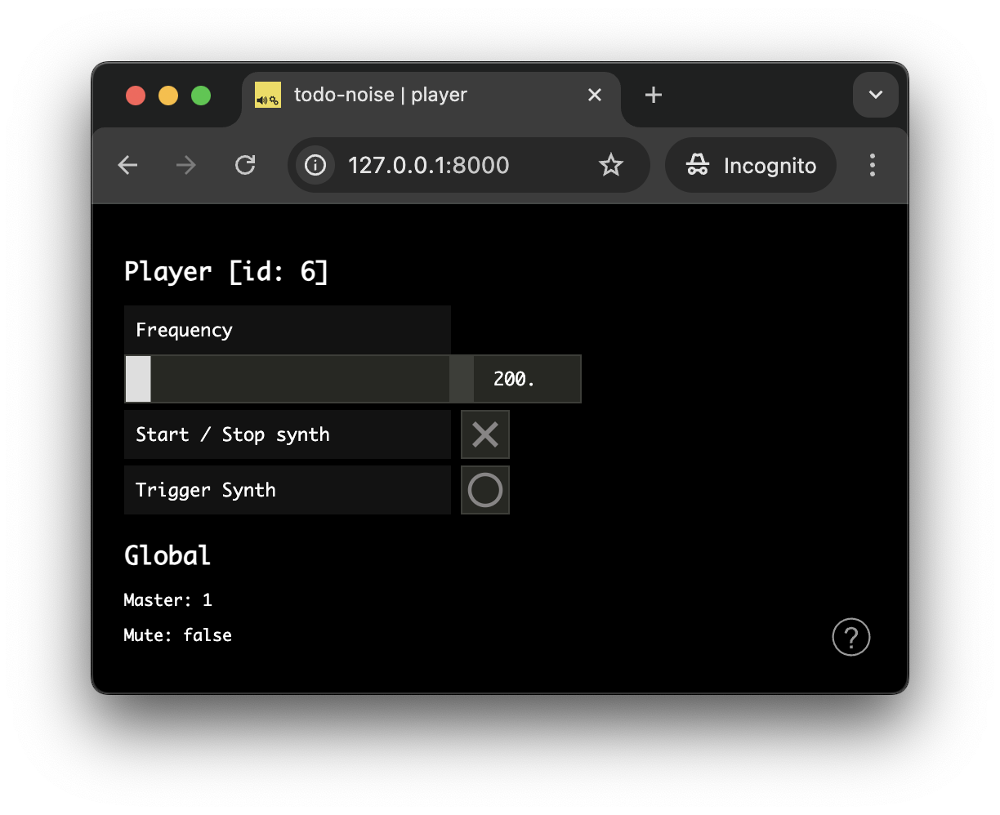

# The _Todo Noise_ Application

In this tutorial we will build a simple application, which shows the most common type of distributed interaction: i.e. remote monitoring and control, you will need to implement your own application.

The tutorial requires basic knowledge of the `soundworks` [state manager](./state-manager.html) and of the [platform-init plugin](./plugin-platform-init.html), so please refer to the relevant tutorials if you didn't check them yet.

Along the way, we will discover the [SharedStateCollection](https://soundworks.dev/soundworks/client.SharedStateCollection.html) proposed by the soundworks' state manager and, how to create our own reusable [Web Components](https://developer.mozilla.org/en-US/docs/Web/API/Web_components) using the [Lit](https://lit.dev/) library proposed by default in soundworks applications.

### Relevant documentation and links

- [client.SharedStateCollection](https://soundworks.dev/soundworks/client.SharedStateCollection.html)
- [server.SharedStateCollection](https://soundworks.dev/soundworks/server.SharedStateCollection.html)
- [@soundworks/plugin-platform-init](https://github.com/collective-soundworks/soundworks-plugin-platform-init)
- [Web Components](https://developer.mozilla.org/en-US/docs/Web/API/Web_components)
- [Lit](https://lit.dev/)

## User Story

The application purposely privileges the point of view of a user in a working situation (i.e. developer, designer, composer or performer) rather than the point of view of the end user (e.g. participant, audience). Indeed, while the later is generally be very specific to the application or artwork, the former generally requires properties and features that are quite common. As such the application is composed of two different types of clients: the `player` and the `controller`

The `player` can be envisioned as the client dedicated to the end users. The application can accept any number of players and each player has access to the following fonctionalities:
- It can trigger a sound.
- It can start and stop a synthesizer.
- It can update a parameter (i.e. the frequency of the synths).

The `controller` is dedicated to the user in working situation, be it during the creation or the performance of the artwork. The application can accept any number of controllers and each of them has access to the following fonctionalities:
- It controls global parameters of the application (i.e. mute, master volume). These globals parameters must indeed be synchronized across every clients of the application (i.e. player and controller).
- It can take full control over any `player`, i.e. the change the volume, trigger a sound and change the state of the synthesizer.

This minimal set of functionalities should provide you a good overview of several important and recurring patterns of real-time distributed audio applications.

## Scaffolding the application

First thing first, let's generate a new empty application with the `@soundworks/create` wizard:

:::info
If needed, refer to the [getting-started](/tutorials/getting-started) page to learn more on how to run the wizard
:::

```sh
cd /path/to/working/directory
npx @soundworks/create@latest todo-noise
```

You can already select the [`@soundworks/plugin-platform-init`](https://github.com/collective-soundworks/soundworks-plugin-platform-init) plugin to have it installed. 


Then, when the wizard asks you for the name of the default client, just call it `player` (with the `browser` target and the `default` template). 


Once the wizard ended, let's launch the `soundworks` development tools inside our application and select the "create a new soundworks client" option to create our second `controller` client:

```sh
cd todo-noise
npx soundworks
```


The devtool wizard will ask you for the same questions as when you just created the `player` client. This time call the client `controller`, choose the `browser` target and the `controller` template. Select `no` when the tool asks if the client should be used as default:


:::tip
Selecting a client as the default means the client will be accessible at the root of the domain, which is more simple if you want to share an url with the public for example). In the other case the name of the client will be used as the route to access it. 

For example, in our application the `player` client would be accessible at `http://my-domain.com` while the `controller` client would be accessible at `http://my-domain.com/controller`
:::

Once done, we can exit the command-line devtool by typing `Ctrl+C` or by choosing the "exit" option.

Now that our project is scaffolded, let's create the schemas describing the states for each `player` as well as the global state.

## Creating and using the shared `globals` state

As mentionned in the user story, the application rely on 2 types of schema: 
- A schema that is tied to each connected player, i.e. each `player` client will create its own state instance from this schema.
- A schema defining global variables of the application (e.g. mute, master volume) which will be unique and shared by every connected clients.

Let's start by defining and creating the global schema. Create a new file named `globals.js` in the `src/server/schemas/` directory, and fill it with the following code:

```js
// src/server/schemas/globals.js
export default {
  master: {
    type: 'float',
    default: 1,
    min: 0,
    max: 1,
  },
  mute: {
    type: 'boolean',
    default: false,
  },
};
```

The global state derived from this schema will keep track of the master volume applied to all connected `player` clients (i.e. a gain between 0 and 1), and wether they are is muted or not.

Once done, let's instaciate the shared `globals` state on the server and attach all clients (i.e. `players`s and `controller`s to it).

### Create the shared instance

First let's create the shared instance on the server:

1. Import the schema in `src/server/index.js`:

```js {5}
// src/server/index.js
import { loadConfig } from '../utils/load-config.js';
import '../utils/catch-unhandled-errors.js';

import globalsSchema from './schemas/globals.js';
```

2. Register the schema into the state manager and create the `globals` state instance:

```js {4-5,8-10}
// src/server/index.js
const server = new Server(config);
server.useDefaultApplicationTemplate();
// register the globals schema
server.stateManager.registerSchema('globals', globalsSchema);

await server.start();
// create the shared globals state instance
const globals = await server.stateManager.create('globals');
console.log(globals.getValues());
```

Let's now start our server using `npm run dev`, you should see the current default values of the state logged in the terminal:


### Attaching the `globals` state to `player` clients

Let's now attach all our `player` clients to the shared state. For now we will only display its current values on the screen and will keep the actual audio code for later. 

To attach to the `globals` state, write the following snippet in the `src/clients/player/index.js` file:

```js {4}
// src/clients/player/index.js
await client.start();

const globals = await client.stateManager.attach('globals');
```

Then, import the `html` templating function from the [Lit](https://lit.dev/) library and add a simple debugging component to the layout that we will render each time the state is updated:

```js {3}
// src/client/player/index
import launcher from '@soundworks/helpers/launcher.js';
import { html } from 'lit';
```

```js {5-16}
// src/client/player/index
const globals = await client.stateManager.attach('globals');
const $layout = createLayout(client, $container);

// add simple log component to the layout
$layout.addComponent({
  render: () => {
    return html`
      <h2>Globals</h2>
      <p>Master: ${globals.get('master')}</p>
      <p>Mute: ${globals.get('mute')}</p>
    `;
  }
});
// update the view each time the globals state is changed
globals.onUpdate(() => $layout.requestUpdate());
```

If you open a player client at [`http://127.0.0.1:8000`](http://127.0.0.1:8000) you should now see the following:


### Controlling the `globals` from the `controller` clients

Now that everything is setup on the `player` side, let's implement our `controller` client to be able to control the `globals` state on all connected clients. Similarly to the `player` clients, let's first open the `src/clients/controller/index.js` and attach to the `globals` state:

```js {4}
// src/client/controller/index.js
await client.start();

const globals = await client.stateManager.attach('globals');
```

Then let's install the [`@ircam/simple-components`](https://ircam-ismm.github.io/simple-components/) library and create our control interface. 
First let's go back to the Terminal, close our development server using `Ctrl+C`,  install the library and restart the server:

```sh
npm install --save @ircam/simple-components
npm run dev
```

:::info
You could also use the `soundworks` devtool to install the library, be aware that the devtool will launch the exact same `npm` command under the hood.
:::

Now that the library is installed, let's import the components we need (i.e. text, slider and toggle) into our controller's `index.js` file:

```js {4-6}
// src/client/controller/index.js
import createLayout from './views/layout.js';

import { html } from 'lit';
import '@ircam/simple-components/sc-text.js';
import '@ircam/simple-components/sc-slider.js';
import '@ircam/simple-components/sc-toggle.js';
```

And finally, add the control component to the layout to control the `globals` shared state:

```js {5-31}
// src/client/controller/index.js
const globals = await client.stateManager.attach('globals');
const $layout = createLayout(client, $container);

// add a control component to the layout
$layout.addComponent({
  render: () => {
    return html`
      <h2>Globals</h2>
      <div style="padding-bottom: 4px">
        <sc-text value="master" readonly></sc-text>
        <sc-slider
          min=${globals.getSchema('master').min}
          max=${globals.getSchema('master').max}
          value=${globals.get('master')}
          width="400"
          @input=${e => globals.set({ master: e.detail.value })}
        ></sc-slider>
      </div>
      <div style="padding-bottom: 4px">
        <sc-text value="mute" readonly></sc-text>
        <sc-toggle
          ?active=${globals.get('mute')}
          @change=${e => globals.set({ mute: e.detail.value })}
        ></sc-toggle>
      </div>
    `;
  }
});
// update the view when the globals state change
globals.onUpdate(() => $layout.requestUpdate());
```

Now, if you open a `player` ([`http://127.0.0.1:8000`](http://127.0.0.1:8000)) and a `controller` ([`http://127.0.0.1:8000/controller`](http://127.0.0.1:8000/controller)) in two different windows side by side ,you should be able to remote control all `player`s from a central controller:


## Creating and using the `player` states

As defined in our user story, we also want the clients to have some controls on their own interface, but importantly we want to be able to take control on any client remotely to simplify and fasten our development and creation process.

:::tip
Indeed, one you start working with several physical devices (e.g. smartphones, tablets), being able to control each of them from a single point can save you a lot of time, which will be better used to improve your artwork and experience. 
:::

### Registering the schema and creating the states

To that end, let's first create and register another schema, from which we will create a new state for each connected players. So let's create a new `src/server/schemas/player.js` file with the following snippet:

```js
// src/server/schemas/player.js
export default {
  id: {
    type: 'integer',
    default: null,
    nullable: true,
  },
  frequency: {
    type: 'float',
    default: 200,
    min: 50,
    max: 2000,
  },
  synthStartStop: {
    type: 'boolean',
    default: false,
    immediate: true,
  },
  synthTrigger: {
    type: 'boolean',
    event: true,
    immediate: true,
  },
};
```

Then register the schema in the server's stateManager:

```js {3,8}
// src/server/index.js
import globalsSchema from './schemas/globals.js';
import playerSchema from './schemas/player.js';

// ...

server.stateManager.registerSchema('globals', globalsSchema);
server.stateManager.registerSchema('player', playerSchema);
```

This values contains in these states will allow us to implement two different types of synthesizer with very common behavior: one which can be started and stopped (e.g. playing a sound file in a loop, see `synthStartStop`) and a second that is triggered by an event (see `synthTrigger`). To keep the audio code simple and focus on the architecture and the logic of the application we will create very simple synthesizers based on oscillators and use the same `frequency` value for the two synths.

:::tip
Note the `immediate` attribute for the `synthStartStop` and `synthTrigger` which is one of the different behaviors that can be applied to shared states. In this case `immediate` means that the value is propagated locally before being propagated on the network to keep the latency and responsiveness of the interface to the minimum. See the different [schema type definitions](https://soundworks.dev/soundworks/server.StateManager.html#~schema) for more informations on these additional attributes.
:::

So let's first create a new `player` state on each `player` client. To that end, add the following snippet in `src/clients/player/index.js`:

```js {5-7}
// src/clients/player/index.js
await client.start();

const globals = await client.stateManager.attach('globals');
const player = await client.stateManager.create('player', {
  id: client.id,
});
```

The second argument passed the `stateManager.create` method allows to define initialization values of the state. Here, we simply pass the `client.id` generated by `soundworks` to the state so we can easily track which state is bound to which client.

### Creating the graphical user interface

Then, let's create the `player` state control interface. To that end, we will create a simple Web Component using the `Lit` library which will allow us to simply reuse the component later in the `controller` interface to remotely take control over any connected `player`. Let's thus create a new file `sw-player.js` in the `src/clients/components` directory, and add the following snippet:

```js
// src/players/components/sw-player.js
import { LitElement, html, css } from 'lit';
import { live } from 'lit/directives/live.js';

// import needed GUI components
import '@ircam/simple-components/sc-text.js';
import '@ircam/simple-components/sc-slider.js';
import '@ircam/simple-components/sc-toggle.js';
import '@ircam/simple-components/sc-bang.js';

class SwPlayer extends LitElement {
  constructor() {
    super();
    // stores the `player` state
    this.playerState = null;
    // stores the `unsubscribe` callback returned by the `state.onUpdate` methos
    // https://soundworks.dev/soundworks/client.SharedState.html#onUpdate
    this._unobserve = null;
  }

  connectedCallback() {
    super.connectedCallback();
    // update the component when a state change occurs
    this._unobserve = this.playerState.onUpdate(() => this.requestUpdate());
  }

  disconnectedCallback() {
    super.disconnectedCallback();
    // stop reacting to state change when the element is removed from the DOM
    this._unobserve();
  }

  render() {
    // create controls for the player state
    return html`
      <h2>Player [id: ${this.playerState.get('id')}]</h2>
      <div style="padding-bottom: 4px;">
        <sc-text value="Frequency" readonly></sc-text>
        <sc-slider
          width="400"
          min=${this.playerState.getSchema('frequency').min}
          max=${this.playerState.getSchema('frequency').max}
          value=${this.playerState.get('frequency')}
          @input=${e => this.playerState.set({ frequency: e.detail.value })}
        ></sc-slider>
      </div>
      <div style="padding-bottom: 4px;">
        <sc-text value="Start / Stop synth" readonly></sc-text>
        <sc-toggle
          ?active=${this.playerState.get('synthStartStop')}
          @change=${e => this.playerState.set({ synthStartStop: e.detail.value })}
        ></sc-toggle>
      </div>
      <div style="padding-bottom: 4px;">
        <sc-text value="Trigger Synth" readonly></sc-text>
        <sc-bang
          ?active=${live(this.playerState.get('synthTrigger'))}
          @input=${e => this.playerState.set({ synthTrigger: e.detail.value })}
        ></sc-bang>
      </div>
    `;
  }
}

// register the component into the custom elements registry
customElements.define('sw-player', SwPlayer);
```

Once done, we only need to import and add our newly created component to the layout and pass it our `player` state:

```js {3,12}
// src/clients/player/index.js
import createLayout from './views/layout.js';
import '../components/sw-player.js';

// ...

const player = await client.stateManager.create('player', {
  id: client.id,
});

const $layout = createLayout(client, $container);
$layout.addComponent(html`<sw-player .playerState=${player}></sc-player>`);
```
 
Your player should now look like the following:



### Creating the synthesizers

Eveything is ready to react to our states (both `player` and `globals` states) changes to trigger some sounds.

Let's first instanciate a new `AudioContext`:

```js {4-5}
// src/clients/player/index.js
const config = window.SOUNDWORKS_CONFIG;

// If multiple clients are emulated you might to want to share the audio context
const audioContext = new AudioContext();

async function main($container) {
  // ...
}
```

#### Resume the context with the `platform-init` plugin

As seen in in the [platform-init plugin](./plugin-platform-init.html) tutorial, the audio context needs a user gesture to be resume and be allowed to produce sound by the browser, so let's just import and configure it properly (just remind that we have already asked the wizard to install it at the beginning of the tutorial).  
Let's start with the server side:

```js {2,12}
// src/server/index.js
import pluginPlatformInit from '@soundworks/plugin-platform-init/server.js';

import globalsSchema from './schemas/globals.js';
import playerSchema from './schemas/player.js';

// ...

const server = new Server(config);
server.useDefaultApplicationTemplate();

server.pluginManager.register('platform-init', pluginPlatformInit);
```

And do the same on the client side:

```js {2,9-13}
// src/clients/player/index.js
import pluginPlatformInit from '@soundworks/plugin-platform-init/client.js';
import createLayout from './views/layout.js';

// ...

const client = new Client(config);

// register the platform-init plugin, and pass it the AudioContext instance
// so that it is resumed on the splashscreen user gesture
client.pluginManager.register('platform-init', pluginPlatformInit, {
  audioContext
});
```

#### Create the master chain

Then we will start by creating the master bus chain that will be controlled by the `globals` state, i.e. a [`GainNode`](https://developer.mozilla.org/en-US/docs/Web/API/GainNode) for the `master` volume parameter, and another one for the `mute` parameter:

```js {1-9}
// create the audio chain
// [mute] -> [master] -> [destination]
const master = audioContext.createGain();
master.gain.value = globals.get('master');
master.connect(audioContext.destination);

const mute = audioContext.createGain();
mute.gain.value = globals.get('mute') ? 0 : 1;
mute.connect(master);

// update the view each time the globals state is changed
globals.onUpdate(() => $layout.requestUpdate());
```

Now, let's modify our `globals.onUpdate` callback, so that any change to the parameters are applied on the audio nodes:

```js 
globals.onUpdate(updates => {
  for (let [key, value] of Object.entries(updates)) {
    switch (key) {
      case 'master': {
        const now = audioContext.currentTime;
        master.gain.setTargetAtTime(value, now, 0.02);
        break;
      }
      case 'mute': {
        const gain = value ? 0 : 1;
        const now = audioContext.currentTime;
        mute.gain.setTargetAtTime(gain, now, 0.02);
        break;
      }
    }
  }
  // update the view each time to log current globals values
  $layout.requestUpdate();
});
```

:::tip
The [`AudioParam::setTargetAtTime`](https://developer.mozilla.org/en-US/docs/Web/API/AudioParam/setTargetAtTime) method is very usefull to simply control audio parameters in real-time without click and pops.
:::

To test that eveything works as expected you can simply add a simple oscillator at the beginning of the chain, and play with a controller to control one or several `player` clients:

```js
const osc = audioContext.createOscillator();
osc.connect(mute);
osc.start();
```

Don't forget to remove this snippet once before going to the next step...

#### Implement the two synths

Now that everything is ready, we can finally implement our two synths. Just recall that to keep things simple and focus on the general architecture we will only create simple synths based on oscillators, however the exact same principles could be used for complex synthesizers with numerous parameters.

Let's thus add the following snippet to our code in order to react to `player` state updates:

```js
let synthStartStop = null;

player.onUpdate(updates => {
  for (let [key, value] of Object.entries(updates)) {
    switch (key) {
      case 'synthStartStop': {
        if (value === true) {
          // start the synth
          synthStartStop = audioContext.createOscillator();
          synthStartStop.connect(mute);
          synthStartStop.frequency.value = player.get('frequency');
          synthStartStop.start();
        } else {
          // stop the synth
          synthStartStop.stop();
          synthStartStop = null;
        }
        break;
      }
      case 'synthTrigger': {
        // trigger a 1 second sound at twice the frequency
        const now = audioContext.currentTime;

        const env = audioContext.createGain();
        env.connect(mute);
        env.gain.value = 0;
        env.gain.setValueAtTime(0, now);
        env.gain.linearRampToValueAtTime(1, now + 0.01);
        env.gain.exponentialRampToValueAtTime(0.001, now + 1);

        const osc = audioContext.createOscillator();
        osc.connect(env);
        osc.frequency.value = player.get('frequency') * 2;
        osc.start(now);
        osc.stop(now + 1);
        break;
      }
      case 'frequency': {
        // update the start / stop synth frequency if it is runnings
        if (synthStartStop !== null) {
          const now = audioContext.currentTime;
          synthStartStop.frequency.setTargetAtTime(value, now, 0.02);
        }
        break;
      }
    }
  }
});
```

And that's all! Our players are now fully functionnal, and their master chain can be controlled remotely from the controllers.

Let's now finish the project by enabling full remote control of any player client from a controller.

## Remotely control players from the controller

Let's go back to our controller and to get a list of all connected players. To that end, the soundworks state manager expose a [`getCollection`](https://soundworks.dev/soundworks/client.StateManager.html#getCollection) method which allows to grab a collection of states that mirror all the states created on the network according to a given schema name. The returned collection is automatically kept synchonized with the states that are created and deleted on the network and offer several methods to work with the list.

First, we need to import new dependencies, among them the Web Component we created for the player client:

```js {3,8-9}
// src/clients/controller/index.js
import { html, nothing } from 'lit';
import { keyed } from 'lit/directives/keyed.js';

import '@ircam/simple-components/sc-text.js';
import '@ircam/simple-components/sc-slider.js';
import '@ircam/simple-components/sc-toggle.js';
import '@ircam/simple-components/sc-button.js';
import '../components/sw-player.js';
```

Then, let's create our `player` collection using the state manager:

```js {3}
// src/clients/controller/index.js
const globals = await client.stateManager.attach('globals');
const players = await client.stateManager.getCollection('player');

const $layout = createLayout(client, $container);
```

Finally we just need to add a component to our layout listing the connected player, and instanciating the `sw-player` component when a player is selected to be controlled remotely:

```js {2-30,35-43}
// src/clients/controller/index.js
// placeholder of the remote controlled player state instance
let remoteControlledPlayer = null;
// collection
$layout.addComponent({
  render: () => {
    return html`
      <h2>Connected players</h2>
      ${players.map(player => {
        return html`
          <sc-button
            value=${player.get('id')}
            @input=${e => {
              remoteControlledPlayer = player;
              $layout.requestUpdate();
            }}
          ></sc-button>
        `;
      })}
      <h2>Remote controlled player</h2>
      ${remoteControlledPlayer !== null
        ? keyed(
            remoteControlledPlayer.get('id'),
            html`<sw-player .playerState=${remoteControlledPlayer}></sw-player>`
          )
        : nothing
      }
    `;
  }
});

// update the view when the globals state change
globals.onUpdate(() => $layout.requestUpdate());

// if a player connects or disconnect, we want to update the view accordingly
players.onAttach(() => $layout.requestUpdate());
players.onDetach(player => {
  // if the player is deleted, we reset the view
  if (player === remoteControlledPlayer) {
    remoteControlledPlayer = null;
  }
  $layout.requestUpdate();
});
```

If you now open a controller ([http://127.0.0.1:8000/controller](http://127.0.0.1:8000/controller)) and emulate several clients in a different window (([http://127.0.0.1:8000?emulate=3](http://127.0.0.1:8000?emulate=3)), you should now see the full application and how the players and controller are kept synchronized through the shared states:


## Conclusion

In this tutorial, you have learned an important pattern that soundworks aims to simplify: the ability of simply creating remote control and monitoring of clients through the shared states. Along the way, you have learned how to create a reusable Web Component using the Lit library.

While the application purposely simplified important aspects of the application to focus on these points, a number of features could improved with simple modification to the structure. For example:

- Improve the start / stop synth so that no click occurs when it is stopped.
- Create more complex synthesizers with more complex audio chains and more parameters.
- Improve the master chain, e.g. use decibels for the master volume to make the slider behavior more natural, add low pass and high pass filters.
- Refactor the synthsizers with classes to create reusable components.
- etc.

In the next tutorial, we will discover ??


